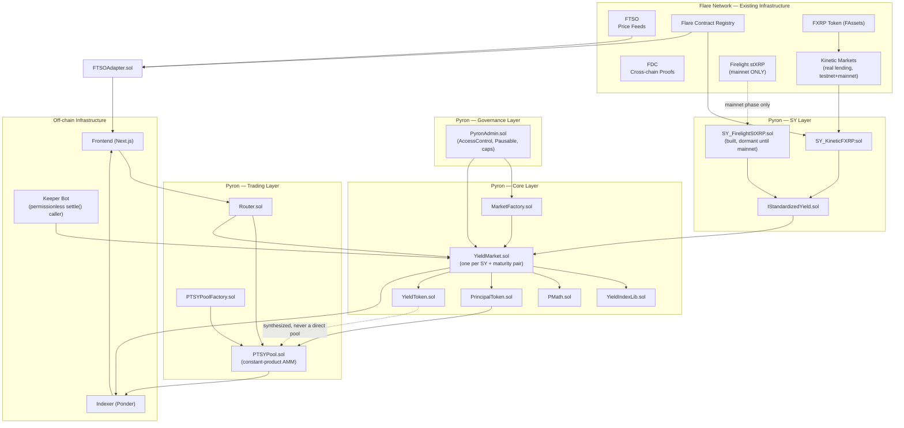
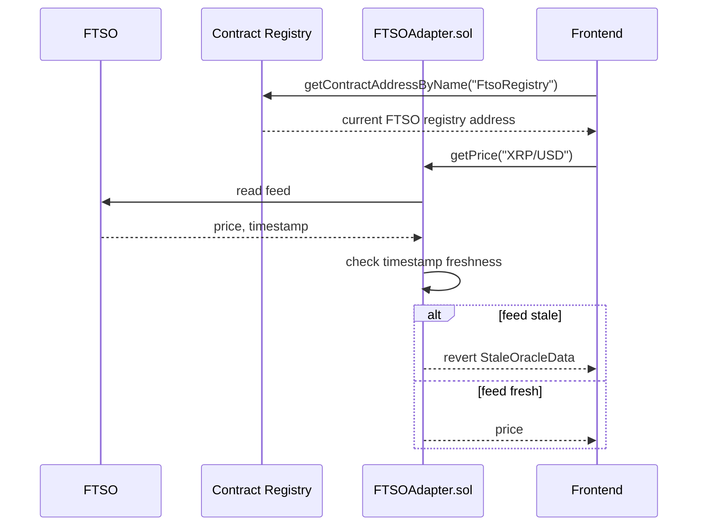
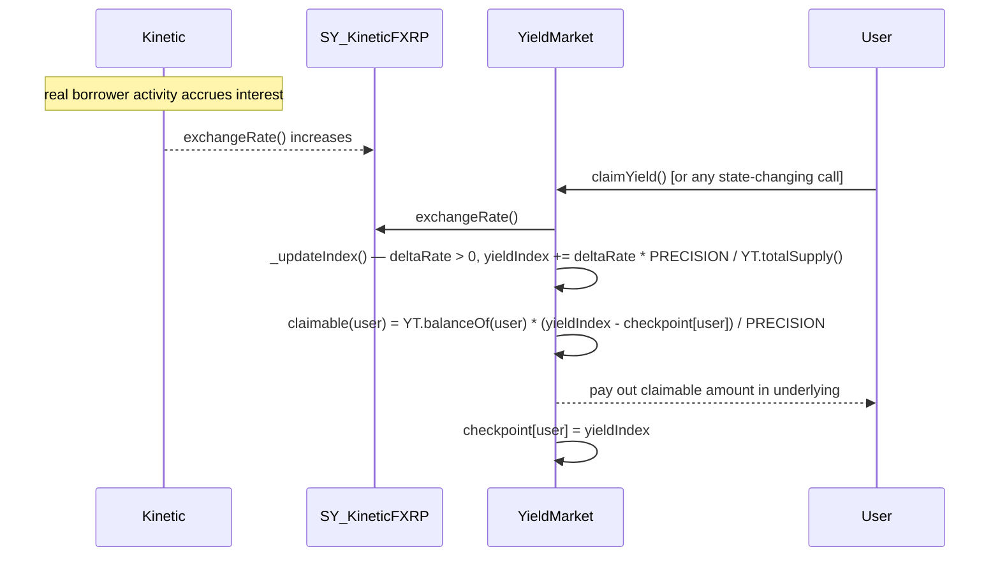
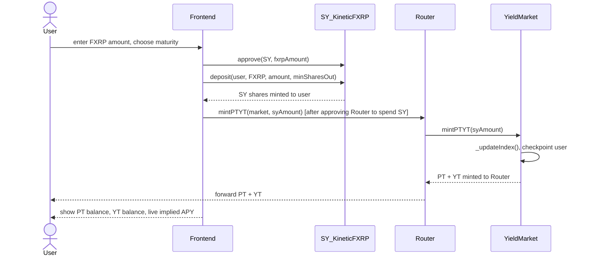
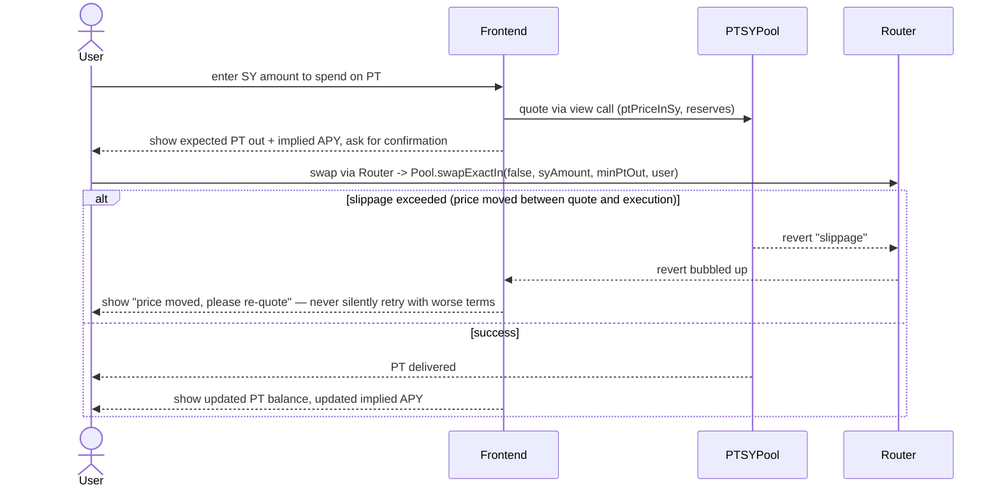
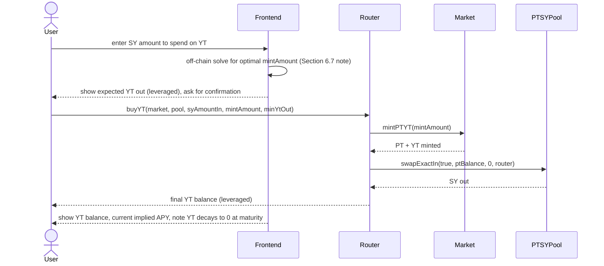
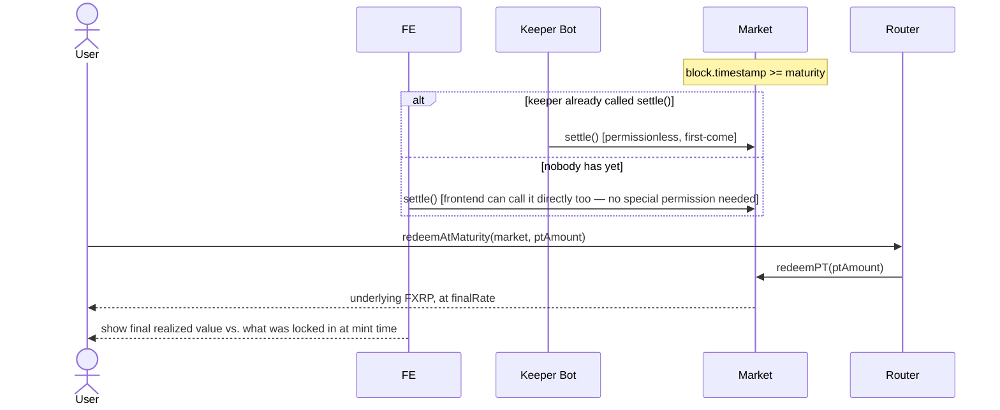

# Pyron Finance

**Fixed-income and yield-trading protocol for Flare's FAssets ecosystem.**

Pyron splits yield-bearing FAsset positions into a fixed-value **Principal Token (PT)** and a leveraged **Yield Token (YT)**. It is Flare's first real fixed-income market — the same category of product that Pendle built on Ethereum, purpose-built for Flare's FAssets/FTSO stack.

> **Naming:** *Pyron* = Pyre (fire — Flare's own branding) + Iron (fixed, unbreakable). PT is the iron: fixed and unbreakable. YT is the pyre: it burns bright and then it's gone at maturity. Every contract, script, and folder name in this document uses `Pyron` — rename freely if you land on something else, but keep the naming consistent across the whole repo once you choose.

This README is written to be **self-contained and buildable end-to-end** — a competent Solidity/TypeScript engineer should be able to go from an empty repo to a fully deployed, fully real (no simulated integrations) testnet protocol using nothing but this document, the Flare developer docs it references, and the actual on-chain contracts it points to.

---

## Table of Contents

1. [Vision, problem, and why this is worth building](#1-vision-problem-and-why-this-is-worth-building)
2. [Non-negotiable build constraint: no simulated integrations](#2-non-negotiable-build-constraint-no-simulated-integrations)
3. [System architecture](#3-system-architecture)
4. [Repository / project skeleton](#4-repository--project-skeleton)
5. [Core protocol mechanics — full deep dive](#5-core-protocol-mechanics--full-deep-dive)
6. [Smart contract specification — full code](#6-smart-contract-specification--full-code)
7. [Flare network integration details](#7-flare-network-integration-details)
8. [App flow — every user journey, step by step](#8-app-flow--every-user-journey-step-by-step)
9. [Dev environment setup](#9-dev-environment-setup)
10. [Build order & deployment runbook — full scripts](#10-build-order--deployment-runbook--full-scripts)
11. [Testing strategy — full test code](#11-testing-strategy--full-test-code)
12. [Indexer / subgraph — full implementation](#12-indexer--subgraph--full-implementation)
13. [Frontend application — full implementation](#13-frontend-application--full-implementation)
14. [Security checklist & invariants](#14-security-checklist--invariants)
15. [CI/CD pipeline — full config](#15-cicd-pipeline--full-config)
16. [Testnet → Audit → Mainnet runbook](#16-testnet--audit--mainnet-runbook)
17. [Operational runbooks (keepers, monitoring, incident response)](#17-operational-runbooks-keepers-monitoring-incident-response)
18. [Gas benchmarks & optimization notes](#18-gas-benchmarks--optimization-notes)
19. [FAQ](#19-faq)
20. [Troubleshooting](#20-troubleshooting)
21. [Glossary](#21-glossary)
22. [Appendix: config, addresses, ABIs](#22-appendix-config-addresses-abis)

---

## 1. Vision, problem, and why this is worth building

### 1.1 The problem, precisely

Flare's FAssets ecosystem (FXRP today; FBTC, FDOGE, FXLM on the roadmap) has, over the last year, built out a genuine DeFi stack around XRP: minting (FAssets), lending (Kinetic), a decentralized CDP-stablecoin (Enosys Loans), liquid staking (Firelight → stXRP), a DEX (SparkDEX), and a yield aggregator (earnXRP). Every one of these gives a holder of FXRP or a derivative of it **variable-rate exposure** — you hold a token, its value (or your claim) grows at whatever rate the underlying strategy produces that week, and you have no way to separate "the principal I want back for sure" from "the yield I'm speculating on."

This is exactly the gap that produced Pendle on Ethereum, a protocol that now regularly carries billions of dollars of TVL, precisely because fixed income is a foundational financial primitive that every mature DeFi ecosystem eventually needs and none of Flare's current protocols provide.

### 1.2 The product, precisely

Pyron takes any yield-bearing FAsset-derived token and splits it into:

- **PT (Principal Token):** a zero-coupon bond. Worth exactly 1 unit of the underlying at a fixed future date, regardless of what the yield rate does between now and then. Trades at a discount today; that discount **is** the market's implied fixed interest rate.
- **YT (Yield Token):** a leveraged, time-boxed claim on 100% of the yield generated between now and maturity. Decays to zero value at maturity.

This creates, for the first time on Flare:
- A way to **lock in a guaranteed fixed yield** on FXRP-derived assets (buy PT at a discount, hold to maturity).
- A way to **speculate or hedge on yield rates themselves** (buy/sell YT) — useful when you have a view on whether Kinetic's utilization rate, or Firelight's staking APY, is about to rise or fall.
- A genuine **term structure of interest rates** for XRPFi, the single missing ingredient for the ecosystem to describe itself as "structured finance," which is language Flare's own team uses when describing what they want to see built on the chain.

### 1.3 Why this, and not something else

Every other layer already has an incumbent on Flare — a new lending market competes with Kinetic, a new liquid-staking token competes with Firelight, a new CDP-stablecoin competes with Enosys. Pyron does not compete with any of them. It **consumes their output as its input.** A healthier Kinetic market and a healthier Firelight both directly make Pyron more useful, and Pyron in turn gives FXRP holders a reason to keep more capital locked in Kinetic and Firelight for longer (buying PT is, functionally, a commitment to keep capital in the underlying strategy until maturity). This is a genuinely symbiotic addition to the ecosystem, not a zero-sum one.

### 1.4 Comparison to the closest prior art

| Aspect | Pendle (Ethereum, Arbitrum, etc.) | Pyron (Flare) |
|---|---|---|
| Underlying yield sources | Lido stETH, EtherFi eETH, Aave aTokens, etc. | Kinetic interest-bearing FXRP (testnet-real today), Firelight stXRP (mainnet, added later), earnXRP (future) |
| Price oracle | Chainlink / internal TWAP | FTSO (Flare's native oracle) |
| AMM curve | Custom time-decay-aware invariant | Constant product for v1 (documented scope cut, see 5.4) |
| Base asset | ETH and ETH-correlated assets | XRP (via FXRP) and other future FAssets |
| Chain-native data verification | N/A | FDC available for future v2 features (see 7.3) |

### 1.5 Success criteria for the testnet build

By the end of following this document, you should have:
- A fully deployed set of contracts on Coston2, every one of them talking to a real, live, non-mocked dependency.
- A working frontend where a wallet can mint, split, trade, claim, and redeem, live, against those real contracts.
- A test suite covering unit correctness (against a controllable mock, per Section 2), live integration correctness (against real Coston2 contracts), and Firelight-specific correctness (against a mainnet fork, since Firelight has no testnet presence).
- A documented, auditable security posture (Section 14) ready to hand to a reviewer before mainnet.

---

## 2. Non-negotiable build constraint: no simulated integrations

This is the single most important operational fact in this document. Read it fully before writing any code.

### 2.1 The rule

**Every contract Pyron deploys to testnet must talk to a real, live, deployed contract — never a mock standing in for a protocol that "isn't available yet."** If a dependency genuinely does not exist on testnet, the correct response is *not* to fake it — it is to defer that specific integration to mainnet and build the rest of the protocol around dependencies that are actually real.

### 2.2 Dependency-by-dependency audit

| Dependency | Real on Coston2 testnet? | Detail | What this means for the build |
|---|---|---|---|
| **FXRP** (FAssets XRP) | ✅ Yes | Coston2's public faucet dispenses real testnet FXRP directly — no minting flow required, unlike mainnet where you must go through the full XRPL-payment + FDC-attestation mint flow | Build and test against real FXRP from day one, no caveats |
| **FTSO** (price oracle) | ✅ Yes | Live, real decentralized price feeds, the same protocol codebase as mainnet, just fed by testnet-scope data providers | Build and test against real FTSO from day one, no caveats |
| **FDC** (Flare Data Connector) | ✅ Yes, with a caveat | Live attestation infrastructure exists on testnet, but testnet has fewer actively-watching attestation providers than mainnet, so proof latency can be less predictable | Real, but budget extra wait-time margin in any FDC-dependent flow; not required for Pyron's core v1 flow at all (see 7.3) |
| **Kinetic Markets** (lending, interest-bearing FXRP) | Originally launched on Coston2 as its public testnet phase before graduating to mainnet | Do not assume the addresses referenced anywhere in this document, or in any third-party source, are current — **pull Kinetic's actively-maintained Coston2 addresses directly from their own docs/GitHub immediately before writing `SY_KineticFXRP.sol`, and re-verify immediately before every deployment** | This is Pyron's primary, fully-real testnet yield source |
| **Firelight** (stXRP liquid staking) | ❌ No testnet deployment exists | Firelight's own integration documentation states this explicitly, and directs third-party integrators toward a mock-strategy pattern for any testnet work — this is Flare-ecosystem reality, not a limitation specific to this repository | You cannot build a non-simulated Firelight integration on testnet. Full stop. Resolution below. |
| **earnXRP** (yield aggregator) | Not documented as having an independent testnet deployment | Treat as mainnet-only until independently verified otherwise | Deferred to a post-mainnet-launch addition, same treatment as Firelight |

### 2.3 The resolution this repo uses

Ship the testnet-deployed protocol with **Kinetic's real interest-bearing FXRP as the sole, fully-real SY source** for the entire testnet phase (`SY_KineticFXRP.sol`). Write `SY_FirelightStXRP.sol` as complete, production-ready, fully-reviewed code during the testnet phase — but **do not deploy or register it with `MarketFactory` until the mainnet phase**, because there is nothing real on testnet to deploy it against. This is not a workaround bolted on to satisfy a constraint; it is the only honest way to build a "no simulation" protocol given Firelight's actual current state. Section 16 gives the exact activation sequence.

### 2.4 The one place a mock legitimately appears, and why it does not violate this rule

The Foundry **unit test suite** (`contracts/test/unit/`) uses `MockStandardizedYield.sol` — a small ERC-20 implementing `IStandardizedYield` with an admin-settable exchange rate. This exists to prove the PT/YT accounting math is correct under conditions a live environment cannot reliably produce on demand: a sudden yield spike, a long stagnant period, a simulated negative-yield/slashing event, extreme dust-amount and extreme-large-amount precision edge cases, and adversarial call-ordering around the maturity boundary.

This is standard practice, not a compromise. Aave's, Compound's, and Pendle's own test suites all do exactly this. The distinguishing fact that keeps this compliant with the "no simulation" rule is simple: **`MockStandardizedYield.sol` is never deployed to any live network, testnet or mainnet.** It exists only inside the test harness. Every contract that actually gets deployed to Coston2 talks only to real, live dependencies, per the table in 2.2.

### 2.5 A note on why this constraint is actually good news

Building the accounting-critical logic against a fully controllable mock first, and only afterward proving it against real integrations, is a stronger validation sequence than the reverse. A live testnet, even a "real" one, has essentially no organic yield activity and no organic adversarial trading — so it cannot exercise the accounting logic's edge cases nearly as thoroughly as a deliberately adversarial unit-test harness can. Treat the constraint in Section 2.1 as a scoping discipline, not a limitation: it forces the correctness work into the layer (unit tests) best suited to prove it, and reserves the live-network layer (integration tests) for what it's actually good at proving — that your contracts correctly speak the real, live ABI and real, live economics of Kinetic, FTSO, and (via mainnet fork) Firelight.

---

## 3. System architecture

### 3.1 High-level component diagram



### 3.2 Layer responsibilities, in detail

**SY Layer.** Normalizes every yield source behind one interface (`IStandardizedYield`) so that the Core Layer never contains a single line of protocol-specific logic. Adding a new yield source in the future (earnXRP, a future FBTC-based Kinetic market, etc.) means writing one new adapter contract and nothing else changes.

**Core Layer.** Owns the actual PT/YT minting, the yield-index accounting, and maturity settlement. This is the layer where a bug is most expensive, and therefore the layer that gets the heaviest unit-test and invariant-test coverage (Section 11).

**Trading Layer.** The AMM pool (PT ⇄ SY only — see 5.4 for why a separate YT pool is unnecessary) and the router that synthesizes YT trades on top of that single pool.

**Governance Layer.** A single `PyronAdmin` contract holding `AccessControl` roles: `MARKET_CREATOR_ROLE` (can call `MarketFactory.createMarket`), `PAUSER_ROLE` (can pause new deposits, never redemption/claim paths), `CAP_SETTER_ROLE` (can adjust per-market deposit caps). Every one of these roles should sit behind a multisig before mainnet (Section 14).

**Off-chain Infrastructure.** The indexer tracks historical exchange-rate snapshots and computes implied-APY time series for charting — this is data no contract should ever try to compute or store on-chain. The keeper bot is a small, permissionless script that calls `YieldMarket.settle()` the moment a maturity passes; `settle()` is callable by anyone (not access-controlled), so the keeper is a convenience, not a trust assumption — worth stating explicitly in your documentation so users understand no centralized party is required for settlement to happen.

### 3.3 Data flow: how a price gets from FTSO to a user's screen



### 3.4 Data flow: how a yield-rate change reaches a YT holder's claimable balance



### 3.5 Network topology across environments

| Environment | Purpose | SY sources active | Contracts deployed |
|---|---|---|---|
| Local (Anvil, no fork) | Fast iteration on Core/Trading layer logic | `MockStandardizedYield` only | Everything, throwaway |
| Local (Anvil, Coston2 fork) | Integration testing against real Kinetic/FTSO state without spending testnet gas | `SY_KineticFXRP` against forked real state | Everything, throwaway |
| Local (Anvil, Flare mainnet fork) | Firelight-specific integration testing (Section 11.3) | `SY_FirelightStXRP` against forked real state | `SY_FirelightStXRP` + Core/Trading layer, throwaway |
| Coston2 testnet (live) | Public, persistent demo and full-flow validation | `SY_KineticFXRP` only | Everything, persistent |
| Flare mainnet | Production | `SY_KineticFXRP` at launch, `SY_FirelightStXRP` added per Section 16 | Everything, persistent, capped |

---

## 4. Repository / project skeleton

```
pyron-finance/
├── contracts/                                  # Foundry project
│   ├── src/
│   │   ├── interfaces/
│   │   │   ├── IStandardizedYield.sol          # SY interface, Section 6.1
│   │   │   ├── IYieldMarket.sol                 # Market interface, Section 6.3
│   │   │   ├── IPrincipalToken.sol
│   │   │   ├── IYieldToken.sol
│   │   │   ├── IPTSYPool.sol                    # AMM interface, Section 6.6
│   │   │   ├── IRouter.sol
│   │   │   └── IFlareContractRegistry.sol       # Registry lookup interface, Section 7
│   │   ├── sy/
│   │   │   ├── SY_KineticFXRP.sol               # real, live on testnet — Section 6.2
│   │   │   └── SY_FirelightStXRP.sol            # real code, dormant until mainnet — Section 6.2
│   │   ├── core/
│   │   │   ├── MarketFactory.sol                # Section 6.4
│   │   │   ├── YieldMarket.sol                  # Section 6.3, the accounting core
│   │   │   ├── PrincipalToken.sol                # Section 6.3
│   │   │   └── YieldToken.sol                    # Section 6.3
│   │   ├── amm/
│   │   │   ├── PTSYPool.sol                     # Section 6.6
│   │   │   └── PTSYPoolFactory.sol
│   │   ├── router/
│   │   │   └── Router.sol                       # Section 6.7
│   │   ├── oracle/
│   │   │   └── FTSOAdapter.sol                  # Section 6.8
│   │   ├── governance/
│   │   │   └── PyronAdmin.sol                   # Section 6.9
│   │   └── libraries/
│   │       ├── PMath.sol                        # 18-decimal fixed point math
│   │       └── YieldIndexLib.sol                # the accumulator, factored out for testability
│   │
│   ├── test/
│   │   ├── unit/                                # MockStandardizedYield-based, Section 11.1
│   │   │   ├── YieldMarket.t.sol
│   │   │   ├── YieldIndexLib.t.sol
│   │   │   ├── PTSYPool.t.sol
│   │   │   ├── Router.t.sol
│   │   │   └── mocks/
│   │   │       └── MockStandardizedYield.sol    # never deployed live — Section 2.4
│   │   ├── integration/                         # real Coston2 contracts, Section 11.2
│   │   │   ├── SY_KineticFXRP.t.sol
│   │   │   ├── FTSOAdapter.t.sol
│   │   │   └── FullFlow.t.sol
│   │   ├── mainnet-fork/                        # real Firelight, forked, Section 11.3
│   │   │   └── SY_FirelightStXRP.t.sol
│   │   └── invariant/                           # Section 11.4
│   │       ├── PyronInvariants.t.sol
│   │       └── handlers/
│   │           └── PyronHandler.sol
│   │
│   ├── script/
│   │   ├── 00_DeployFTSOAdapter.s.sol
│   │   ├── 01_DeploySYKineticFXRP.s.sol
│   │   ├── 02_DeployMarketFactory.s.sol
│   │   ├── 03_DeployFirstMarket.s.sol
│   │   ├── 04_DeployPTSYPool.s.sol
│   │   ├── 05_DeployRouter.s.sol
│   │   ├── 06_SeedInitialLiquidity.s.sol
│   │   ├── 90_ActivateFirelightSY.s.sol         # mainnet-phase only, Section 16
│   │   └── lib/
│   │       └── DeploymentJson.sol               # helper for reading/writing deployments/*.json
│   │
│   ├── deployments/
│   │   ├── coston2.json                         # written by scripts, read by frontend/indexer
│   │   └── flare.json                           # created at mainnet phase
│   │
│   ├── foundry.toml
│   ├── remappings.txt
│   └── .env.example
│
├── indexer/                                     # Ponder event indexer, Section 12
│   ├── ponder.config.ts
│   ├── ponder.schema.ts
│   ├── src/
│   │   ├── YieldMarket.ts
│   │   ├── PTSYPool.ts
│   │   └── SY_KineticFXRP.ts
│   ├── abis/
│   │   ├── YieldMarket.json
│   │   ├── PTSYPool.json
│   │   └── SY_KineticFXRP.json
│   └── package.json
│
├── frontend/                                    # Next.js app, Section 13
│   │                                            # carries BOTH surfaces: the
│   │                                            # marketing site at / and the
│   │                                            # protocol app behind it
│   ├── app/
│   │   ├── (marketing)/                         # own <html>: fluid 1rem = 1vw
│   │   │   ├── layout.tsx
│   │   │   ├── page.tsx                         # landing; hero CTA → /markets
│   │   │   └── landing.css
│   │   ├── (app)/                               # own <html>: fixed 16px root
│   │   │   ├── layout.tsx                       # chrome + persistent balance strip
│   │   │   ├── markets/
│   │   │   │   ├── page.tsx                     # market list
│   │   │   │   └── [address]/
│   │   │   │       └── page.tsx                 # trade/mint/liquidity/claim/redeem
│   │   │   ├── portfolio/page.tsx
│   │   │   ├── pool/page.tsx
│   │   │   └── learn/page.tsx                   # glossary + strategy chooser
│   │   ├── api/
│   │   │   ├── deployments/route.ts             # reads deployments/*.json per request
│   │   │   └── indexer/[...path]/route.ts       # server-side proxy to Ponder
│   │   └── providers.tsx
│   ├── components/
│   │   ├── marketing/                           # LandingEffects, LaunchApp, WaitlistForm
│   │   ├── app/                                 # TopBar, BalanceStrip, MarketsTable,
│   │   │                                        # ApyChart, YieldSourceRail, …
│   │   ├── panels/                              # MintSplit, Trade, Claim, Redeem,
│   │   │                                        # Liquidity, ActionButton, AmountField
│   │   └── ui/Primitives.tsx
│   ├── lib/
│   │   ├── wagmi.ts
│   │   ├── chains.ts
│   │   ├── contracts.ts                         # network-aware addresses + ABIs
│   │   ├── apy.ts                               # the three rate definitions
│   │   ├── format.ts                            # decimals live here — see 13.x
│   │   └── abis/                                # generated, git-ignored
│   ├── hooks/
│   │   ├── useMarkets.ts                        # discovers markets from the factory
│   │   ├── useBalances.ts
│   │   ├── useQuote.ts
│   │   ├── useTx.ts                             # approve → sign → mined
│   │   ├── useNow.ts                            # CHAIN time, not wall-clock
│   │   └── useIndexer.ts
│   ├── styles/
│   │   ├── tokens.css                           # shared by both surfaces
│   │   └── app.css
│   ├── package.json
│   └── next.config.mjs
│
├── docs/
│   ├── ARCHITECTURE.md                          # expanded version of Section 3
│   ├── TOKENOMICS.md                            # if/when a governance token is added
│   └── AUDIT_SCOPE.md                           # Section 14, formatted for an external auditor
│
├── .github/
│   └── workflows/
│       ├── contracts-ci.yml                     # Section 15
│       └── frontend-ci.yml
│
├── .env.example
└── README.md                                    # this file
```

### 4.1 Why this shape, specifically

- **`sy/` is isolated from `core/`** on purpose — the Core Layer contracts (`YieldMarket`, `PrincipalToken`, `YieldToken`) must never import anything from `sy/` beyond the `IStandardizedYield` interface. If you ever find yourself importing `SY_KineticFXRP` directly into `YieldMarket.sol`, that's a signal the abstraction has leaked and needs fixing before it becomes a bigger refactor later.
- **`test/unit/`, `test/integration/`, `test/mainnet-fork/` are separate folders, not separate test functions in the same file** — this makes it trivial to run only the fast, free, no-network unit suite in a tight development loop (`forge test --match-path test/unit/*`), and to run the slower, network-dependent suites only in CI or before a deployment milestone.
- **`script/` files are numbered** so the deployment order in Section 10 is self-documenting from the filesystem alone — anyone opening the `script/` folder for the first time can tell the required order without reading this README.
- **`deployments/*.json` is the single source of truth for addresses** — every script writes to it, the next script reads from it, and the frontend/indexer read from it too. Nobody should ever hand-copy an address between these systems; that's exactly the kind of manual step that produces the address-mismatch bugs this ecosystem has already seen with FXRP's own legacy-vs-current address confusion.

---

## 5. Core protocol mechanics — full deep dive

### 5.1 Standardized Yield (SY) interface, in full

```solidity
// SPDX-License-Identifier: MIT
pragma solidity ^0.8.24;

import {IERC20} from "@openzeppelin/contracts/token/ERC20/IERC20.sol";

/// @title IStandardizedYield
/// @notice Common interface every yield source is wrapped behind, so the
///         Core Layer never contains protocol-specific logic.
interface IStandardizedYield is IERC20 {
    /// @notice Deposit `tokenIn` and mint SY shares to `receiver`.
    /// @param receiver address to receive minted SY shares
    /// @param tokenIn the token being deposited (must be the accepted base asset, e.g. FXRP)
    /// @param amountIn amount of tokenIn to deposit
    /// @param minSharesOut slippage protection — revert if fewer shares would be minted
    /// @return amountSharesOut actual SY shares minted
    function deposit(
        address receiver,
        address tokenIn,
        uint256 amountIn,
        uint256 minSharesOut
    ) external returns (uint256 amountSharesOut);

    /// @notice Burn SY shares and redeem the underlying `tokenOut`.
    /// @param receiver address to receive the redeemed underlying
    /// @param amountSharesToRedeem SY shares to burn
    /// @param tokenOut token to receive (must be the accepted base asset)
    /// @param minTokenOut slippage protection
    /// @return amountTokenOut actual underlying amount paid out
    function redeem(
        address receiver,
        uint256 amountSharesToRedeem,
        address tokenOut,
        uint256 minTokenOut
    ) external returns (uint256 amountTokenOut);

    /// @notice Underlying units redeemable per 1 SY share, 18-decimal fixed point.
    /// @dev MUST be monotonically non-decreasing under normal operating conditions.
    ///      MUST NOT be computed from a raw balanceOf() call on a token that a
    ///      third party could directly transfer into — see Section 14, donation attack.
    function exchangeRate() external view returns (uint256);

    /// @notice The base asset this SY wraps (e.g. the FXRP token address).
    function getBaseAsset() external view returns (address);
}
```

### 5.2 Splitting SY into PT + YT — the exact lifecycle

**State that exists per deployed market:**

```solidity
struct MarketState {
    IStandardizedYield sy;
    uint256 maturity;          // unix timestamp
    uint256 yieldIndex;        // 18-decimal, monotonically non-decreasing
    uint256 lastRate;          // sy.exchangeRate() at last checkpoint
    uint256 lastUpdateTime;
    uint256 finalRate;         // locked at settle(), 0 until then
    bool settled;
}
```

**Mint flow, exactly:**

1. `msg.sender` calls `Market.mintPTYT(syAmount)`.
2. Market transfers `syAmount` of the SY token from `msg.sender` into itself (`safeTransferFrom`).
3. Market calls `_updateIndex()` (defined in 5.3) **before** minting — this ensures any yield that accrued between the last checkpoint and now is credited to the *existing* YT holders before new YT supply dilutes the denominator.
4. Market mints `syAmount` `PrincipalToken` and `syAmount` `YieldToken` to `msg.sender`.
5. Market sets `userIndexCheckpoint[msg.sender] = yieldIndex` for the newly minted YT (so the new holder starts accruing from now, not from the market's inception).

**Why step 3 must happen before step 4, precisely:** if you minted new YT supply first and updated the index second, the `_updateIndex()` calculation's `yieldToken.totalSupply()` denominator would already include the newly minted YT, incorrectly diluting the yield owed to yield accrued *before* those new tokens existed. This is exactly the kind of ordering bug that Section 11.4's invariant tests are designed to catch — write a test that mints, waits, and mints again, and assert the first minter's claimable yield is unaffected by the second mint.

**PT redemption, exactly** (only valid after `settled == true`):

1. `msg.sender` calls `Market.redeemPT(ptAmount)`.
2. Market burns `ptAmount` `PrincipalToken` from `msg.sender`.
3. Market computes `underlyingOut = ptAmount` (1:1 by construction — the entire point of a zero-coupon bond).
4. Market calls `sy.redeem(msg.sender, sySharesEquivalent, baseAsset, minOut)` to convert the corresponding SY reserves into the underlying and pay it out.

**Yield claim, exactly** (valid any time, before or after maturity, as long as unclaimed yield exists):

1. `msg.sender` calls `Market.claimYield()`.
2. Market calls `_updateIndex()`.
3. Market computes `owed = ytBalance(msg.sender) * (yieldIndex - userIndexCheckpoint[msg.sender]) / PRECISION`.
4. Market sets `userIndexCheckpoint[msg.sender] = yieldIndex`.
5. Market calls `sy.redeem(msg.sender, owedInSyTerms, baseAsset, minOut)` to pay out.

**Recombination, exactly** (valid only while `!settled`):

1. `msg.sender` calls `Market.combine(amount)`.
2. Market calls `_updateIndex()` and settles any pending yield claim implicitly for the caller's YT being burned (do not let yield silently evaporate on combine — either auto-claim it or revert if there's unclaimed yield and require an explicit `claimYield()` first; document whichever choice you make, and test it).
3. Market burns `amount` PT and `amount` YT from `msg.sender`.
4. Market mints/transfers `amount` SY back to `msg.sender`.

### 5.3 Yield accounting — the accumulator, fully worked

**The core invariant this section exists to protect:**

```
Market.syReserves() >= ptOwedAtPar + unclaimedYtYield     (ALWAYS)
```

**The accumulator implementation** (this is what lives in `YieldIndexLib.sol`, factored out of `YieldMarket.sol` so it can be unit-tested in complete isolation):

```solidity
// SPDX-License-Identifier: MIT
pragma solidity ^0.8.24;

library YieldIndexLib {
    uint256 internal constant PRECISION = 1e18;

    struct Accumulator {
        uint256 yieldIndex;
        uint256 lastRate;
    }

    /// @notice Advance the accumulator given a fresh SY exchange rate reading.
    /// @dev Called before every mint/claim/redeem/combine/settle, always in that
    ///      relative order (advance index, then do the requested action).
    function update(
        Accumulator storage acc,
        uint256 currentRate,
        uint256 ytTotalSupply
    ) internal {
        if (acc.lastRate == 0) {
            // first-ever checkpoint for this market — nothing to accrue yet
            acc.lastRate = currentRate;
            return;
        }
        if (currentRate > acc.lastRate && ytTotalSupply > 0) {
            uint256 deltaRate = currentRate - acc.lastRate;
            acc.yieldIndex += (deltaRate * PRECISION) / ytTotalSupply;
        }
        // NOTE: currentRate < acc.lastRate (a negative-yield / slashing event) is
        // handled explicitly in Section 5.3.1 below — do not silently ignore it.
        acc.lastRate = currentRate;
    }

    /// @notice Yield owed to a YT holder since their last checkpoint.
    function claimable(
        Accumulator storage acc,
        uint256 ytBalance,
        uint256 userCheckpoint
    ) internal view returns (uint256) {
        uint256 delta = acc.yieldIndex - userCheckpoint;
        return (ytBalance * delta) / PRECISION;
    }
}
```

**Worked numeric example, step by step:**

Assume Kinetic's real FXRP lending market is running at an effective ~6% APY, and a market is created with a 180-day maturity.

| Step | Action | `lastRate` | `yieldIndex` | YT total supply |
|---|---|---|---|---|
| 0 | Market created | `1.000000` | `0` | `0` |
| 1 | Alice mints with 1,000 SY | `1.000000` (no change yet, index update runs but delta=0) | `0` | `1,000` |
| 2 | 90 days pass, Kinetic's real interest accrues | rate reads `1.030000` on next interaction | — | `1,000` |
| 3 | Bob calls `claimYield()` for himself (triggers `_updateIndex`) | `1.030000` | `(1.030000 - 1.000000) * 1e18 / 1,000 = 3.0e13` (scaled) | `1,000` |
| 4 | Bob's claimable, if he minted at step 1 with `checkpoint = 0` | — | — | `1,000 * 3.0e13 / 1e18 = 30` units of underlying |
| 5 | Carol mints 500 new SY at this point | index update runs first (no rate change since step 3, so no-op), *then* mint happens | `1.030000` | unchanged | `1,500` |
| 6 | Another 90 days pass, rate reaches `1.061` | — | — | `1,500` |
| 7 | Alice calls `claimYield()` | `1.061` | `previous + (1.061-1.030)*1e18/1,500` | `1,500` |

Notice in step 5 → 7 that the *denominator* used for the second accrual period is `1,500` (post-Carol's mint), correctly giving Carol her fair share of yield generated only after she joined, while Alice and Bob's earlier-accrued yield (computed against the smaller `1,000` denominator) is unaffected. This is precisely why `_updateIndex()` must run **before** any supply-changing action, as stated in 5.2.

### 5.3.1 The negative-yield edge case — decide this explicitly, do not leave it implicit

If `currentRate < acc.lastRate` (e.g., a slashing event on an underlying staking protocol, or, less dramatically, a Kinetic market briefly showing a lower exchange rate due to a bad-debt event), the accumulator as written above simply does not decrease `yieldIndex` — it silently sets `lastRate` to the new, lower value and moves on. This means: **YT holders never "give back" yield, but PT holders' 1:1 redemption guarantee is no longer necessarily fully covered by SY reserves.**

You must pick one of the following and implement + test it explicitly before mainnet:

- **Option A — Socialized haircut:** if `Market.syReserves()` ever falls short of `ptOwedAtPar + unclaimedYtYield` at settlement time, PT holders redeem pro-rata instead of strictly 1:1. Simple to implement, but weakens PT's "guaranteed" pitch.
- **Option B — Insurance buffer:** maintain a small protocol-owned buffer (funded by a portion of AMM trading fees) that absorbs small negative-yield events before PT holders are ever affected. More work, preserves PT's guarantee under normal-severity events.
- **Option C — Disallow negative-yield SY sources entirely:** add a require-check in `_updateIndex` that reverts (or pauses the market) if `currentRate < acc.lastRate` beyond some tiny rounding tolerance, forcing a governance decision before the market can proceed. Simplest to reason about; costs you liveness during a real negative-yield event.

Document your choice in `docs/AUDIT_SCOPE.md` explicitly — an auditor will ask this question regardless of which answer you give, and "we hadn't decided" is the answer that costs you the most time during review.

### 5.4 AMM design — one pool, not two, derived from first principles

**Why you don't need a YT/SY pool:** by construction (Section 5.2), `1 SY == 1 PT + 1 YT` at all times, reversibly, before maturity. This means the market price of YT is never an independent quantity — it is always exactly `price(SY) - price(PT)`. Given that identity, any trade "in YT" can be constructed out of a mint/combine operation plus a trade against a single PT/SY pool:

**Buy YT — full mechanical derivation:**

A user wants to spend `Δsy` of SY to acquire the maximum possible YT. The router:
1. Mints `Δsy` PT and `Δsy` YT (from a temporary SY deposit, possibly flash-borrowed — see implementation note below).
2. Sells the resulting `Δsy` PT into the PT/SY pool, receiving `Δsy'` SY back.
3. Uses that `Δsy'` to mint more PT+YT, and repeats — or, more efficiently, solves the whole loop as a single closed-form quantity using the pool's constant-product formula, so the entire operation executes as one flash-loan-style transaction with one swap call, not an actual iterative loop on-chain (looping on-chain would be gas-prohibitive; solve it algebraically off-chain in the router's quote function, then execute the single resulting trade on-chain).

**Sell YT — full mechanical derivation:**

A user wants to sell `Δyt` YT for SY before maturity. Since they don't hold matching PT, the router:
1. Flash-borrows `Δyt` PT from the pool (a same-transaction borrow-and-repay, structured as: take PT out, use it, replenish the pool's PT balance from the proceeds of the next step, all within one transaction — implemented either via the pool's own flash-swap callback pattern or via the router momentarily holding pool-owned inventory under a trusted-router allowance, whichever your pool implementation supports).
2. Combines the borrowed `Δyt` PT with the user's `Δyt` YT via `Market.combine()`, receiving `Δyt` SY.
3. Repays the pool the PT-equivalent value it flash-borrowed (in SY terms, per the pool's current price), and sends the remainder to the user.

**Buy/Sell PT directly:** a plain swap against the PT/SY pool — no synthesis required, this is the simplest path and functionally identical to buying/selling a discount bond.

**Pool invariant (v1, constant product):**

```
x * y = k
```
where `x` = PT reserves, `y` = SY reserves. Standard Uniswap V2 core math — fork it, do not reimplement it from scratch; the value in this protocol is in the PT/YT layer above the pool, not in reinventing AMM math.

**Implied fixed APY, derived:**

If 1 PT currently trades for `p` SY (`p < 1`, since PT doesn't earn yield until maturity and is therefore worth less than 1 SY today), and `T` seconds remain until maturity:

```
impliedAPY = (1/p - 1) * (365 days / T)
```

**Worked example:** PT trades at `p = 0.971` SY with `T = 180 days` remaining:

```
impliedAPY = (1/0.971 - 1) * (365/180)
           = (1.02987... - 1) * 2.0278
           = 0.02987 * 2.0278
           ≈ 0.0606  →  ~6.06% annualized
```

This is the number your frontend's `ImpliedAPYChart` component (Section 13) should be computing and displaying live, recalculated on every pool-reserve change.

### 5.5 Maturity settlement, exactly

```solidity
function settle() external {
    require(block.timestamp >= maturity, "not matured");
    require(!settled, "already settled");
    _updateIndex();              // final accrual, exactly as of maturity
    finalRate = sy.exchangeRate();
    settled = true;
    emit Settled(finalRate, block.timestamp);
}
```

Note `settle()` is deliberately **permissionless** — anyone can call it (a keeper bot, a user trying to redeem, or a bored community member). This removes any centralized-trust assumption from the single most economically important state transition in the protocol, and should be described that way explicitly in your documentation and your judging/audit submission.

---

## 6. Smart contract specification — full code

The contracts below are complete, compilable starting points — not pseudocode. They intentionally omit a small number of implementation choices that only you can make correctly (which negative-yield option from 5.3.1, your exact fee schedule, your exact role-assignment addresses) and mark each one with a `// TODO(you):` comment. Everything else is meant to compile and pass the test suite in Section 11 as written.

### 6.1 `libraries/PMath.sol`

```solidity
// SPDX-License-Identifier: MIT
pragma solidity ^0.8.24;

/// @title PMath
/// @notice Minimal 18-decimal fixed-point helpers used throughout Pyron.
library PMath {
    uint256 internal constant ONE = 1e18;

    error MulOverflow();
    error DivByZero();

    function mulDown(uint256 a, uint256 b) internal pure returns (uint256) {
        return (a * b) / ONE;
    }

    function divDown(uint256 a, uint256 b) internal pure returns (uint256) {
        if (b == 0) revert DivByZero();
        return (a * ONE) / b;
    }

    function min(uint256 a, uint256 b) internal pure returns (uint256) {
        return a < b ? a : b;
    }

    function max(uint256 a, uint256 b) internal pure returns (uint256) {
        return a > b ? a : b;
    }

    /// @notice Annualized implied rate from a discount price and time remaining.
    /// @param priceInSy price of 1 PT, denominated in SY, 18-decimal (must be <= ONE)
    /// @param secondsToMaturity time remaining until maturity
    function impliedApy(uint256 priceInSy, uint256 secondsToMaturity)
        internal
        pure
        returns (uint256)
    {
        if (secondsToMaturity == 0 || priceInSy == 0) return 0;
        uint256 inverse = divDown(ONE, priceInSy); // 1/p
        uint256 discount = inverse - ONE;          // (1/p - 1)
        uint256 annualizer = divDown(365 days * ONE, secondsToMaturity * ONE) ; // 365d / T, careful with scaling
        return mulDown(discount, annualizer);
    }
}
```

### 6.2 `libraries/YieldIndexLib.sol`

See Section 5.3 for the fully-annotated version — reproduced here as the canonical file contents:

```solidity
// SPDX-License-Identifier: MIT
pragma solidity ^0.8.24;

library YieldIndexLib {
    uint256 internal constant PRECISION = 1e18;

    struct Accumulator {
        uint256 yieldIndex;
        uint256 lastRate;
    }

    event RateDecreased(uint256 previousRate, uint256 newRate);

    function update(
        Accumulator storage acc,
        uint256 currentRate,
        uint256 ytTotalSupply
    ) internal {
        if (acc.lastRate == 0) {
            acc.lastRate = currentRate;
            return;
        }
        if (currentRate > acc.lastRate && ytTotalSupply > 0) {
            uint256 deltaRate = currentRate - acc.lastRate;
            acc.yieldIndex += (deltaRate * PRECISION) / ytTotalSupply;
        } else if (currentRate < acc.lastRate) {
            // TODO(you): implement your Section 5.3.1 decision here.
            // Option C (safest default) shown:
            emit RateDecreased(acc.lastRate, currentRate);
            revert("negative yield: market paused pending governance decision");
        }
        acc.lastRate = currentRate;
    }

    function claimable(
        Accumulator storage acc,
        uint256 ytBalance,
        uint256 userCheckpoint
    ) internal view returns (uint256) {
        uint256 delta = acc.yieldIndex - userCheckpoint;
        return (ytBalance * delta) / PRECISION;
    }
}
```

### 6.3 `core/YieldMarket.sol`, `PrincipalToken.sol`, `YieldToken.sol`

```solidity
// SPDX-License-Identifier: MIT
pragma solidity ^0.8.24;

import {ERC20} from "@openzeppelin/contracts/token/ERC20/ERC20.sol";
import {SafeERC20} from "@openzeppelin/contracts/token/ERC20/utils/SafeERC20.sol";
import {IERC20} from "@openzeppelin/contracts/token/ERC20/IERC20.sol";
import {ReentrancyGuard} from "@openzeppelin/contracts/utils/ReentrancyGuard.sol";
import {IStandardizedYield} from "../interfaces/IStandardizedYield.sol";
import {YieldIndexLib} from "../libraries/YieldIndexLib.sol";

contract PrincipalToken is ERC20 {
    address public immutable market;

    modifier onlyMarket() {
        require(msg.sender == market, "PT: only market");
        _;
    }

    constructor(string memory name_, string memory symbol_, address market_)
        ERC20(name_, symbol_)
    {
        market = market_;
    }

    function mint(address to, uint256 amount) external onlyMarket {
        _mint(to, amount);
    }

    function burn(address from, uint256 amount) external onlyMarket {
        _burn(from, amount);
    }
}

contract YieldToken is ERC20 {
    address public immutable market;

    modifier onlyMarket() {
        require(msg.sender == market, "YT: only market");
        _;
    }

    constructor(string memory name_, string memory symbol_, address market_)
        ERC20(name_, symbol_)
    {
        market = market_;
    }

    function mint(address to, uint256 amount) external onlyMarket {
        _mint(to, amount);
    }

    function burn(address from, uint256 amount) external onlyMarket {
        _burn(from, amount);
    }

    /// @dev Forces a yield checkpoint on both parties of every transfer, so a
    ///      transfer can never be used to dodge or duplicate a claim. This is
    ///      the exact bug class flagged in Section 6.3 note below — do not
    ///      remove this hook.
    function _update(address from, address to, uint256 value) internal override {
        if (from != address(0)) YieldMarket(market).checkpointUser(from);
        if (to != address(0)) YieldMarket(market).checkpointUser(to);
        super._update(from, to, value);
    }
}

/// @title YieldMarket
/// @notice One deployed instance per (SY, maturity) pair. Owns PT/YT minting,
///         the yield-index accounting (Section 5.3), and maturity settlement.
contract YieldMarket is ReentrancyGuard {
    using SafeERC20 for IERC20;
    using YieldIndexLib for YieldIndexLib.Accumulator;

    IStandardizedYield public immutable sy;
    PrincipalToken public immutable pt;
    YieldToken public immutable yt;
    uint256 public immutable maturity;

    YieldIndexLib.Accumulator private accumulator;
    mapping(address => uint256) public userIndexCheckpoint;

    uint256 public finalRate;
    bool public settled;

    event PTYTMinted(address indexed user, uint256 syAmount);
    event YieldClaimed(address indexed user, uint256 amount);
    event Combined(address indexed user, uint256 amount);
    event Settled(uint256 finalRate, uint256 timestamp);

    constructor(address sy_, uint256 maturity_, string memory ptName, string memory ptSymbol, string memory ytName, string memory ytSymbol) {
        require(maturity_ > block.timestamp, "maturity in past");
        sy = IStandardizedYield(sy_);
        maturity = maturity_;
        pt = new PrincipalToken(ptName, ptSymbol, address(this));
        yt = new YieldToken(ytName, ytSymbol, address(this));
    }

    // ---------------------------------------------------------------------
    // Core actions
    // ---------------------------------------------------------------------

    function mintPTYT(uint256 syAmount) external nonReentrant returns (uint256) {
        require(!settled, "matured");
        _updateIndex();                                   // BEFORE minting — see Section 5.2
        IERC20(address(sy)).safeTransferFrom(msg.sender, address(this), syAmount);
        pt.mint(msg.sender, syAmount);
        yt.mint(msg.sender, syAmount);
        userIndexCheckpoint[msg.sender] = accumulator.yieldIndex;
        emit PTYTMinted(msg.sender, syAmount);
        return syAmount;
    }

    function redeemPT(uint256 ptAmount) external nonReentrant returns (uint256) {
        require(settled, "not matured");
        pt.burn(msg.sender, ptAmount);
        // finalRate already locked at settle() — pay out 1:1 in underlying terms
        uint256 out = sy.redeem(msg.sender, ptAmount, sy.getBaseAsset(), 0);
        return out;
    }

    function claimYield() external nonReentrant returns (uint256) {
        _updateIndex();
        uint256 owed = accumulator.claimable(yt.balanceOf(msg.sender), userIndexCheckpoint[msg.sender]);
        userIndexCheckpoint[msg.sender] = accumulator.yieldIndex;
        if (owed > 0) {
            sy.redeem(msg.sender, owed, sy.getBaseAsset(), 0);
            emit YieldClaimed(msg.sender, owed);
        }
        return owed;
    }

    function combine(uint256 amount) external nonReentrant returns (uint256) {
        require(!settled, "matured, use redeemPT");
        _updateIndex();
        // Auto-settle any pending yield on the YT being burned, so it is never
        // silently lost — see Section 5.2, recombination step 2.
        uint256 owed = accumulator.claimable(yt.balanceOf(msg.sender), userIndexCheckpoint[msg.sender]);
        if (owed > 0) {
            sy.redeem(msg.sender, owed, sy.getBaseAsset(), 0);
            emit YieldClaimed(msg.sender, owed);
        }
        userIndexCheckpoint[msg.sender] = accumulator.yieldIndex;
        pt.burn(msg.sender, amount);
        yt.burn(msg.sender, amount);
        IERC20(address(sy)).safeTransfer(msg.sender, amount);
        emit Combined(msg.sender, amount);
        return amount;
    }

    function settle() external {
        require(block.timestamp >= maturity, "not matured");
        require(!settled, "already settled");
        _updateIndex();
        finalRate = sy.exchangeRate();
        settled = true;
        emit Settled(finalRate, block.timestamp);
    }

    // ---------------------------------------------------------------------
    // Accounting internals
    // ---------------------------------------------------------------------

    function _updateIndex() internal {
        accumulator.update(sy.exchangeRate(), yt.totalSupply());
    }

    /// @dev Called by YieldToken._update on every transfer so a transfer can
    ///      never be used to duplicate or dodge a yield claim.
    function checkpointUser(address user) external {
        require(msg.sender == address(yt), "only YT");
        _updateIndex();
        uint256 owed = accumulator.claimable(yt.balanceOf(user), userIndexCheckpoint[user]);
        userIndexCheckpoint[user] = accumulator.yieldIndex;
        if (owed > 0) {
            sy.redeem(user, owed, sy.getBaseAsset(), 0);
            emit YieldClaimed(user, owed);
        }
    }

    // ---------------------------------------------------------------------
    // Views
    // ---------------------------------------------------------------------

    function claimable(address user) external view returns (uint256) {
        // NOTE: this view does not include yield accrued since the last
        // on-chain checkpoint if exchangeRate() has moved since then — the
        // frontend should treat this as "as of last interaction" and combine
        // it with a fresh off-chain read of sy.exchangeRate() for a live display.
        return accumulator.claimable(yt.balanceOf(user), userIndexCheckpoint[user]);
    }

    function syReserves() external view returns (uint256) {
        return IERC20(address(sy)).balanceOf(address(this));
    }

    function yieldIndex() external view returns (uint256) {
        return accumulator.yieldIndex;
    }
}
```

**Implementation notes worth reading before you type this out:**
- `YieldToken._update`'s call back into `YieldMarket.checkpointUser` means every YT transfer costs extra gas for a checkpoint + potential payout. This is deliberate and necessary (Section 6.3 note in the code above) — do not "optimize" it away without an equivalent replacement mechanism, or you reopen the exact transfer-based yield-duplication bug this hook exists to close.
- `combine()` auto-claims pending yield rather than reverting if there's unclaimed yield — this was the choice flagged as an open decision in Section 5.2 step 2; the code above picks the auto-claim behavior. If you prefer the revert-and-require-explicit-claim behavior instead, change it here and update your tests accordingly.
- `YieldIndexLib.update`'s negative-yield branch currently implements **Option C** from Section 5.3.1 (revert / effectively pause). If you choose Option A or B instead, this is the one function to change — the rest of the contract is unaffected either way, which is exactly why this logic was factored into its own library.

### 6.4 `core/MarketFactory.sol`

```solidity
// SPDX-License-Identifier: MIT
pragma solidity ^0.8.24;

import {AccessControl} from "@openzeppelin/contracts/access/AccessControl.sol";
import {YieldMarket} from "./YieldMarket.sol";

contract MarketFactory is AccessControl {
    bytes32 public constant MARKET_CREATOR_ROLE = keccak256("MARKET_CREATOR_ROLE");

    address[] public allMarkets;
    mapping(address => mapping(uint256 => address)) public marketBySyAndMaturity; // sy => maturity => market

    event MarketCreated(address indexed sy, uint256 indexed maturity, address market);

    constructor(address admin) {
        _grantRole(DEFAULT_ADMIN_ROLE, admin);
        _grantRole(MARKET_CREATOR_ROLE, admin);
    }

    function createMarket(
        address sy,
        uint256 maturity,
        string calldata ptName,
        string calldata ptSymbol,
        string calldata ytName,
        string calldata ytSymbol
    ) external onlyRole(MARKET_CREATOR_ROLE) returns (address market) {
        require(marketBySyAndMaturity[sy][maturity] == address(0), "market exists");
        market = address(new YieldMarket(sy, maturity, ptName, ptSymbol, ytName, ytSymbol));
        marketBySyAndMaturity[sy][maturity] = market;
        allMarkets.push(market);
        emit MarketCreated(sy, maturity, market);
    }

    function allMarketsLength() external view returns (uint256) {
        return allMarkets.length;
    }
}
```

---

### 6.5 `sy/SY_KineticFXRP.sol` and `sy/SY_FirelightStXRP.sol`

```solidity
// SPDX-License-Identifier: MIT
pragma solidity ^0.8.24;

import {ERC20} from "@openzeppelin/contracts/token/ERC20/ERC20.sol";
import {SafeERC20} from "@openzeppelin/contracts/token/ERC20/utils/SafeERC20.sol";
import {IERC20} from "@openzeppelin/contracts/token/ERC20/IERC20.sol";
import {IStandardizedYield} from "../interfaces/IStandardizedYield.sol";

/// @dev Minimal interface for Kinetic's cToken-style lending market.
///      TODO(you): replace with Kinetic's actual current ABI, pulled fresh
///      from their docs/GitHub immediately before writing this file for real —
///      see Section 2.2. Field/function names below are illustrative.
interface IKineticMarket {
    function mint(uint256 mintAmount) external returns (uint256);
    function redeem(uint256 redeemTokens) external returns (uint256);
    function exchangeRateStored() external view returns (uint256);
    function underlying() external view returns (address);
}

/// @title SY_KineticFXRP
/// @notice Real, live SY wrapper around Kinetic's FXRP lending market.
///         This is Pyron's primary, fully-real testnet yield source (Section 2.3).
contract SY_KineticFXRP is ERC20, IStandardizedYield {
    using SafeERC20 for IERC20;

    IKineticMarket public immutable kinetic;
    IERC20 public immutable fxrp;
    uint256 private constant PRECISION = 1e18;

    // Donation-attack mitigation (Section 14): a small permanently-locked
    // "dead" deposit, seeded at construction, so the very first real
    // depositor cannot be griefed by a direct-transfer share-price attack.
    uint256 public constant DEAD_SHARES = 1000;

    constructor(address kineticMarket_, string memory name_, string memory symbol_)
        ERC20(name_, symbol_)
    {
        kinetic = IKineticMarket(kineticMarket_);
        fxrp = IERC20(kinetic.underlying());
        _mint(address(0xdead), DEAD_SHARES);
    }

    function deposit(address receiver, address tokenIn, uint256 amountIn, uint256 minSharesOut)
        external
        returns (uint256 amountSharesOut)
    {
        require(tokenIn == address(fxrp), "SY: unsupported token");
        fxrp.safeTransferFrom(msg.sender, address(this), amountIn);
        fxrp.forceApprove(address(kinetic), amountIn);

        uint256 balBefore = _kineticTokenBalance();
        kinetic.mint(amountIn);
        uint256 kTokensReceived = _kineticTokenBalance() - balBefore;

        // Normalize Kinetic's own cToken-style shares into Pyron SY shares at
        // a fixed internal 1:1 mapping at wrap-time; SY's own exchangeRate()
        // (below) is what actually reflects yield growth to the rest of the
        // protocol, so this internal mapping only needs to be consistent,
        // not itself yield-bearing.
        amountSharesOut = kTokensReceived;
        require(amountSharesOut >= minSharesOut, "SY: slippage");
        _mint(receiver, amountSharesOut);
    }

    function redeem(address receiver, uint256 amountSharesToRedeem, address tokenOut, uint256 minTokenOut)
        external
        returns (uint256 amountTokenOut)
    {
        require(tokenOut == address(fxrp), "SY: unsupported token");
        _burn(msg.sender, amountSharesToRedeem);

        uint256 balBefore = fxrp.balanceOf(address(this));
        kinetic.redeem(amountSharesToRedeem);
        amountTokenOut = fxrp.balanceOf(address(this)) - balBefore;

        require(amountTokenOut >= minTokenOut, "SY: slippage");
        fxrp.safeTransfer(receiver, amountTokenOut);
    }

    /// @notice Underlying FXRP redeemable per 1 SY share, 18-decimal.
    /// @dev Reads Kinetic's real exchangeRateStored() — never derived from a
    ///      raw balanceOf() on a token a third party could directly donate to.
    function exchangeRate() external view returns (uint256) {
        return kinetic.exchangeRateStored();
    }

    function getBaseAsset() external view returns (address) {
        return address(fxrp);
    }

    function _kineticTokenBalance() internal view returns (uint256) {
        // TODO(you): if Kinetic's market itself is the ERC-20 (cToken pattern),
        // this is IERC20(address(kinetic)).balanceOf(address(this)); confirm
        // against Kinetic's actual current contract shape before writing.
        return IERC20(address(kinetic)).balanceOf(address(this));
    }
}
```

```solidity
// SPDX-License-Identifier: MIT
pragma solidity ^0.8.24;

import {ERC20} from "@openzeppelin/contracts/token/ERC20/ERC20.sol";
import {SafeERC20} from "@openzeppelin/contracts/token/ERC20/utils/SafeERC20.sol";
import {IERC20} from "@openzeppelin/contracts/token/ERC20/IERC20.sol";
import {IStandardizedYield} from "../interfaces/IStandardizedYield.sol";

/// @dev Firelight's stXRP vault is ERC-4626 compliant per their own
///      integration docs — this interface mirrors the standard directly.
interface IERC4626Like {
    function deposit(uint256 assets, address receiver) external returns (uint256 shares);
    function redeem(uint256 shares, address receiver, address owner) external returns (uint256 assets);
    function convertToAssets(uint256 shares) external view returns (uint256);
    function totalAssets() external view returns (uint256);
    function totalSupply() external view returns (uint256);
    function asset() external view returns (address);
}

/// @title SY_FirelightStXRP
/// @notice Complete, production-ready SY wrapper around Firelight's stXRP vault.
/// @dev NOT deployed and NOT registered with MarketFactory during the testnet
///      phase — Firelight has no testnet deployment to point this at
///      (Section 2.2). This file is written and fully fork-tested (Section 11.3)
///      during the testnet build, then activated per the runbook in Section 16.
contract SY_FirelightStXRP is ERC20, IStandardizedYield {
    using SafeERC20 for IERC20;

    IERC4626Like public immutable firelight;
    IERC20 public immutable fxrp;

    constructor(address firelightVault_, string memory name_, string memory symbol_)
        ERC20(name_, symbol_)
    {
        firelight = IERC4626Like(firelightVault_);
        fxrp = IERC20(firelight.asset());
    }

    function deposit(address receiver, address tokenIn, uint256 amountIn, uint256 minSharesOut)
        external
        returns (uint256 amountSharesOut)
    {
        require(tokenIn == address(fxrp), "SY: unsupported token");
        fxrp.safeTransferFrom(msg.sender, address(this), amountIn);
        fxrp.forceApprove(address(firelight), amountIn);

        uint256 shares = firelight.deposit(amountIn, address(this));
        amountSharesOut = shares;
        require(amountSharesOut >= minSharesOut, "SY: slippage");
        _mint(receiver, amountSharesOut);
    }

    function redeem(address receiver, uint256 amountSharesToRedeem, address tokenOut, uint256 minTokenOut)
        external
        returns (uint256 amountTokenOut)
    {
        require(tokenOut == address(fxrp), "SY: unsupported token");
        _burn(msg.sender, amountSharesToRedeem);
        amountTokenOut = firelight.redeem(amountSharesToRedeem, receiver, address(this));
        require(amountTokenOut >= minTokenOut, "SY: slippage");
    }

    function exchangeRate() external view returns (uint256) {
        // stXRP:FXRP ratio, normalized to 18 decimals — convertToAssets(1e18)
        // is exactly Firelight's own documented exchange-rate read pattern.
        return firelight.convertToAssets(1e18);
    }

    function getBaseAsset() external view returns (address) {
        return address(fxrp);
    }
}
```

### 6.6 `amm/PTSYPool.sol`

```solidity
// SPDX-License-Identifier: MIT
pragma solidity ^0.8.24;

import {ERC20} from "@openzeppelin/contracts/token/ERC20/ERC20.sol";
import {SafeERC20} from "@openzeppelin/contracts/token/ERC20/utils/SafeERC20.sol";
import {IERC20} from "@openzeppelin/contracts/token/ERC20/IERC20.sol";
import {ReentrancyGuard} from "@openzeppelin/contracts/utils/ReentrancyGuard.sol";

/// @title PTSYPool
/// @notice Constant-product AMM between a market's PT and its SY token.
///         v1 scope: standard Uniswap V2 core math (Section 5.4) — the
///         time-decay-aware curve is a documented v2 improvement, not built here.
contract PTSYPool is ERC20, ReentrancyGuard {
    using SafeERC20 for IERC20;

    IERC20 public immutable pt;
    IERC20 public immutable sy;
    uint256 public reservePt;
    uint256 public reserveSy;
    uint256 public constant FEE_BPS = 30; // 0.30%, standard v2-style fee
    uint256 public constant MINIMUM_LIQUIDITY = 1000;

    event Mint(address indexed provider, uint256 ptIn, uint256 syIn, uint256 lpOut);
    event Burn(address indexed provider, uint256 ptOut, uint256 syOut, uint256 lpIn);
    event Swap(address indexed trader, bool ptIn, uint256 amountIn, uint256 amountOut);

    constructor(address pt_, address sy_) ERC20("Pyron PT-SY LP", "PYRON-LP") {
        pt = IERC20(pt_);
        sy = IERC20(sy_);
    }

    function addLiquidity(uint256 ptAmount, uint256 syAmount, uint256 minLpOut)
        external
        nonReentrant
        returns (uint256 lpOut)
    {
        pt.safeTransferFrom(msg.sender, address(this), ptAmount);
        sy.safeTransferFrom(msg.sender, address(this), syAmount);

        if (totalSupply() == 0) {
            lpOut = _sqrt(ptAmount * syAmount) - MINIMUM_LIQUIDITY;
            _mint(address(0xdead), MINIMUM_LIQUIDITY); // permanently locked, standard v2 pattern
        } else {
            lpOut = _min(
                (ptAmount * totalSupply()) / reservePt,
                (syAmount * totalSupply()) / reserveSy
            );
        }
        require(lpOut >= minLpOut, "slippage");
        _mint(msg.sender, lpOut);
        reservePt += ptAmount;
        reserveSy += syAmount;
        emit Mint(msg.sender, ptAmount, syAmount, lpOut);
    }

    function removeLiquidity(uint256 lpAmount, uint256 minPtOut, uint256 minSyOut)
        external
        nonReentrant
        returns (uint256 ptOut, uint256 syOut)
    {
        ptOut = (lpAmount * reservePt) / totalSupply();
        syOut = (lpAmount * reserveSy) / totalSupply();
        require(ptOut >= minPtOut && syOut >= minSyOut, "slippage");
        _burn(msg.sender, lpAmount);
        reservePt -= ptOut;
        reserveSy -= syOut;
        pt.safeTransfer(msg.sender, ptOut);
        sy.safeTransfer(msg.sender, syOut);
        emit Burn(msg.sender, ptOut, syOut, lpAmount);
    }

    /// @param ptIn true if the trader is selling PT for SY, false for the reverse
    function swapExactIn(bool ptIn, uint256 amountIn, uint256 minAmountOut, address to)
        external
        nonReentrant
        returns (uint256 amountOut)
    {
        (uint256 reserveIn, uint256 reserveOut) = ptIn ? (reservePt, reserveSy) : (reserveSy, reservePt);
        uint256 amountInWithFee = amountIn * (10_000 - FEE_BPS);
        amountOut = (amountInWithFee * reserveOut) / (reserveIn * 10_000 + amountInWithFee);
        require(amountOut >= minAmountOut, "slippage");

        if (ptIn) {
            pt.safeTransferFrom(msg.sender, address(this), amountIn);
            reservePt += amountIn;
            reserveSy -= amountOut;
            sy.safeTransfer(to, amountOut);
        } else {
            sy.safeTransferFrom(msg.sender, address(this), amountIn);
            reserveSy += amountIn;
            reservePt -= amountOut;
            pt.safeTransfer(to, amountOut);
        }
        emit Swap(msg.sender, ptIn, amountIn, amountOut);
    }

    /// @notice Current spot price of 1 PT, denominated in SY, 18-decimal.
    function ptPriceInSy() external view returns (uint256) {
        if (reservePt == 0) return 0;
        return (reserveSy * 1e18) / reservePt;
    }

    function _sqrt(uint256 x) internal pure returns (uint256 y) {
        if (x == 0) return 0;
        uint256 z = (x + 1) / 2;
        y = x;
        while (z < y) {
            y = z;
            z = (x / z + z) / 2;
        }
    }

    function _min(uint256 a, uint256 b) internal pure returns (uint256) {
        return a < b ? a : b;
    }
}
```

### 6.7 `router/Router.sol`

```solidity
// SPDX-License-Identifier: MIT
pragma solidity ^0.8.24;

import {SafeERC20} from "@openzeppelin/contracts/token/ERC20/utils/SafeERC20.sol";
import {IERC20} from "@openzeppelin/contracts/token/ERC20/IERC20.sol";
import {YieldMarket} from "../core/YieldMarket.sol";
import {PTSYPool} from "../amm/PTSYPool.sol";

/// @title Router
/// @notice User-facing entry point. Synthesizes YT trades on top of the
///         single PT/SY pool per the derivation in Section 5.4 — there is
///         intentionally no separate YT/SY pool anywhere in this system.
contract Router {
    using SafeERC20 for IERC20;

    function mintPTYT(YieldMarket market, uint256 syAmount) external returns (uint256) {
        IERC20(address(market.sy())).safeTransferFrom(msg.sender, address(this), syAmount);
        IERC20(address(market.sy())).forceApprove(address(market), syAmount);
        market.mintPTYT(syAmount);
        market.pt().transfer(msg.sender, syAmount);
        market.yt().transfer(msg.sender, syAmount);
        return syAmount;
    }

    /// @notice Buy YT by minting PT+YT from `syAmountIn` and selling the PT
    ///         leg into the pool, in one transaction (Section 5.4 derivation).
    /// @dev The exact-loop math is solved off-chain by the frontend's quote
    ///      call and passed in as `mintAmount` (total SY to route through the
    ///      mint, after accounting for the PT sale) — do not attempt to loop
    ///      mint/sell on-chain, it is gas-prohibitive and unnecessary.
    function buyYT(YieldMarket market, PTSYPool pool, uint256 syAmountIn, uint256 mintAmount, uint256 minYtOut)
        external
        returns (uint256 ytOut)
    {
        IERC20 sy = IERC20(address(market.sy()));
        sy.safeTransferFrom(msg.sender, address(this), syAmountIn);
        sy.forceApprove(address(market), mintAmount);
        market.mintPTYT(mintAmount);

        uint256 ptBal = market.pt().balanceOf(address(this));
        market.pt().approve(address(pool), ptBal);
        pool.swapExactIn(true, ptBal, 0, address(this));

        ytOut = market.yt().balanceOf(address(this));
        require(ytOut >= minYtOut, "slippage");
        market.yt().transfer(msg.sender, ytOut);
    }

    /// @notice Sell YT via flash-borrowing the matching PT from the pool,
    ///         combining, and repaying — see Section 5.4 derivation.
    /// @dev Requires PTSYPool (or a thin flash-swap extension of it) to
    ///      support a flash-borrow-and-callback pattern; if your pool
    ///      implementation doesn't yet, this is the one AMM feature beyond
    ///      plain Uniswap V2 core math you need to add.
    function sellYT(YieldMarket market, PTSYPool pool, uint256 ytAmountIn, uint256 minSyOut)
        external
        returns (uint256 syOut)
    {
        // TODO(you): implement the flash-borrow callback against your chosen
        // pool's flash-swap interface; pseudocode of the intended flow:
        //   1. pool.flashBorrowPt(ytAmountIn, address(this))
        //   2. market.pt().approve(address(market), ytAmountIn)
        //   3. market.yt().transferFrom(msg.sender, address(this), ytAmountIn)
        //   4. market.combine(ytAmountIn)  -> receives SY
        //   5. repay pool's PT loan from a portion of that SY (swap or direct, per your pool design)
        //   6. transfer remainder SY to msg.sender
        revert("implement per Section 6.7 TODO before use");
    }

    function claimYield(YieldMarket market) external returns (uint256) {
        uint256 owed = market.claimYield();
        return owed;
    }

    function redeemAtMaturity(YieldMarket market, uint256 ptAmount) external returns (uint256) {
        market.pt().transferFrom(msg.sender, address(this), ptAmount);
        market.pt().approve(address(market), ptAmount);
        return market.redeemPT(ptAmount);
    }
}
```

### 6.8 `oracle/FTSOAdapter.sol`

```solidity
// SPDX-License-Identifier: MIT
pragma solidity ^0.8.24;

import {IFlareContractRegistry} from "../interfaces/IFlareContractRegistry.sol";

/// @dev Minimal FTSO registry interface — confirm exact function names
///      against Flare's current dev docs (dev.flare.network) before deploying;
///      FTSO's public interface has had versioned updates (FTSOv2).
interface IFtsoRegistry {
    function getCurrentPriceWithDecimals(string calldata symbol)
        external
        view
        returns (uint256 price, uint256 timestamp, uint256 decimals);
}

/// @title FTSOAdapter
/// @notice Thin, read-only wrapper resolving FTSO through Flare's Contract
///         Registry, with mandatory staleness checking (Section 14).
contract FTSOAdapter {
    IFlareContractRegistry public constant REGISTRY =
        IFlareContractRegistry(0xaD67FE66660Fb8dFE9d6b1b4240d8650e30F6019);

    uint256 public constant MAX_STALENESS_SECONDS = 300; // 5 minutes — tune per feed cadence

    error StaleOracleData(uint256 timestamp, uint256 nowTs);

    function getPrice(string calldata symbol) external view returns (uint256 price) {
        address ftsoRegistry = REGISTRY.getContractAddressByName("FtsoRegistry");
        (uint256 rawPrice, uint256 timestamp, uint256 decimals) =
            IFtsoRegistry(ftsoRegistry).getCurrentPriceWithDecimals(symbol);

        if (block.timestamp - timestamp > MAX_STALENESS_SECONDS) {
            revert StaleOracleData(timestamp, block.timestamp);
        }

        // normalize to 18 decimals
        if (decimals < 18) {
            price = rawPrice * (10 ** (18 - decimals));
        } else {
            price = rawPrice / (10 ** (decimals - 18));
        }
    }
}
```

### 6.9 `governance/PyronAdmin.sol`

```solidity
// SPDX-License-Identifier: MIT
pragma solidity ^0.8.24;

import {AccessControl} from "@openzeppelin/contracts/access/AccessControl.sol";
import {Pausable} from "@openzeppelin/contracts/utils/Pausable.sol";

/// @title PyronAdmin
/// @notice Central role registry and pause/cap controller. Deliberately does
///         NOT gate claim/redeem paths behind pause — only new deposits.
///         Every role below must be assigned to a multisig, never an EOA,
///         before mainnet (Section 14).
contract PyronAdmin is AccessControl, Pausable {
    bytes32 public constant MARKET_CREATOR_ROLE = keccak256("MARKET_CREATOR_ROLE");
    bytes32 public constant PAUSER_ROLE = keccak256("PAUSER_ROLE");
    bytes32 public constant CAP_SETTER_ROLE = keccak256("CAP_SETTER_ROLE");

    mapping(address => uint256) public marketDepositCap; // market => max SY depositable, 0 = uncapped

    event CapSet(address indexed market, uint256 cap);

    constructor(address admin) {
        _grantRole(DEFAULT_ADMIN_ROLE, admin);
    }

    function pauseDeposits() external onlyRole(PAUSER_ROLE) {
        _pause();
    }

    function unpauseDeposits() external onlyRole(PAUSER_ROLE) {
        _unpause();
    }

    function setMarketCap(address market, uint256 cap) external onlyRole(CAP_SETTER_ROLE) {
        marketDepositCap[market] = cap;
        emit CapSet(market, cap);
    }
}
```

---

## 7. Flare network integration details

### 7.1 Network parameters, both environments

| Parameter | Coston2 (testnet) | Flare (mainnet) |
|---|---|---|
| Chain ID | `114` | `14` |
| RPC | `https://coston2-api.flare.network/ext/C/rpc` | `https://flare-api.flare.network/ext/C/rpc` |
| Explorer | `https://coston2-explorer.flare.network` | `https://flarescan.com` |
| Native gas token | C2FLR (testnet) | FLR |
| Faucet | `https://faucet.flare.network/` — dispenses C2FLR, FXRP, USDT0 directly; rate-limited to 0.01 C2FLR/day per address | N/A |
| Flare Contract Registry | `0xaD67FE66660Fb8dFE9d6b1b4240d8650e30F6019` | same address — this registry is deployed at the same address across Flare networks by design |
| Typical block time | ~2–3 seconds | ~2–3 seconds |
| Typical gas price | faucet-funded, effectively free | ~25 gwei typical |

### 7.2 Never hardcode dependent-protocol addresses — resolve at runtime

```solidity
interface IFlareContractRegistry {
    function getContractAddressByName(string calldata name) external view returns (address);
}

// usage anywhere you need a Flare-native contract address:
IFlareContractRegistry registry = IFlareContractRegistry(0xaD67FE66660Fb8dFE9d6b1b4240d8650e30F6019);
address assetManager = registry.getContractAddressByName("AssetManager");
address ftsoRegistry = registry.getContractAddressByName("FtsoRegistry");
```

This isn't a style preference — the FAssets ecosystem has already shown real address churn (a "legacy" FXRP address on Coston2 was deprecated in favor of dynamic resolution, per Flare's own FAssets integration documentation). Any contract you write that hardcodes a dependency address is a contract that will silently break the next time that dependency upgrades.

### 7.3 FDC (Flare Data Connector) — not required for v1, here is exactly why

Pyron's core PT/YT flow never needs to independently verify an external-chain event, because by the time FXRP reaches Pyron it is already a fully-minted ERC-20 — the FAssets system itself already did the FDC-verified minting work upstream. FDC would only become relevant to Pyron if you build a specific v2 feature: independently attesting to an XRPL-side staking event (e.g., proving Firelight's underlying validator rewards landed) rather than trusting Firelight's own contract state for that. Document this as an explicit, deferred roadmap item rather than building it into v1 — it adds real complexity (attestation request/response cycles, proof verification) for a v1 feature set that does not need it.

### 7.4 Firelight activation path — a full walkthrough of what changes at mainnet

During testnet, `SY_FirelightStXRP.sol` exists in the repo, compiles, and is fully covered by the mainnet-fork test suite (Section 11.3) — but it is never deployed to Coston2 and never registered with `MarketFactory`. At the mainnet phase (Section 16, step 6), the sequence is:

1. Resolve Firelight's current mainnet stXRP vault address fresh from their own docs (do not reuse any address cached in this README).
2. Deploy `SY_FirelightStXRP` pointed at that address, on Flare mainnet.
3. Call `MarketFactory.createMarket(address(syFirelight), maturity, ...)` — this is the exact same factory call already proven against `SY_KineticFXRP` throughout the testnet phase, now pointed at a second, real SY source.
4. Deploy a second `PTSYPool` for this new market, seed it with initial liquidity, deploy/wire a second `Router` instance or extend the existing one to accept multiple markets (the `Router` contract in Section 6.7 is already written to take a `YieldMarket` parameter per call, so no redeploy is needed — this is a design choice worth preserving specifically so this step is this simple).
5. Update `deployments/flare.json`, the frontend's `lib/contracts.ts`, and the indexer's config to include the new market.

### 7.5 Gas cost expectations (mainnet, illustrative — always re-check against current gas price)

| Action | Approx. gas | Approx. cost @ 25 gwei, illustrative FLR price |
|---|---|---|
| `mintPTYT` | ~180,000 | dominated by an ERC-20 transferFrom + two mints |
| `claimYield` | ~90,000 | one SY redeem call |
| `swapExactIn` (pool) | ~120,000 | standard v2-style swap |
| `redeemPT` | ~110,000 | one SY redeem call |
| `settle` | ~60,000 | one storage write, permissionless |
| `Router.buyYT` (composite) | ~350,000 | mint + pool swap combined in one tx |

---

## 8. App flow — every user journey, step by step

### 8.1 Mint + Split (get PT and YT)



### 8.2 Buy PT (lock in fixed yield) — including the failure path



### 8.3 Buy YT (leveraged yield speculation)



### 8.4 Claim yield (YT holders) — including the zero-claimable path

`Router.claimYield(market)` → `Market.claimYield()` → pays out per Section 5.3. Frontend polls `Market.claimable(user)` as a free view call to show pending yield in real time, and should visibly disable the "Claim" button (rather than letting the user pay gas for a no-op transaction) when the polled value is zero.

### 8.5 Sell YT / Sell PT (exit early)

Mirror flows of 8.2/8.3 using the flash-borrow-and-combine composite in `Router.sellYT` (Section 6.7 — flagged as a TODO requiring your specific pool's flash-swap support), or a direct pool swap for `sellPT`.

### 8.6 Redeem at maturity — including the pre-settlement path



### 8.7 Portfolio view

Frontend aggregates, per connected wallet, across every deployed market: PT positions (face value + maturity date + guaranteed redemption value), YT positions (live claimable yield + current market-implied APY + time-to-maturity decay indicator), and LP positions in any `PTSYPool` (share of pool + accrued trading fees).

### 8.8 Error and edge-case states the frontend must handle explicitly

| Condition | Required UI behavior |
|---|---|
| Wallet not connected | Every action panel shows a connect-wallet prompt instead of a disabled button with no explanation |
| Insufficient FXRP/SY/PT/YT balance for the requested action | Inline validation before transaction submission, not a revert the user discovers after paying gas |
| Market already settled, user tries to `mintPTYT` | Hide the mint/split panel entirely post-maturity; show only claim/redeem panels |
| Market not yet settled, user tries `redeemPT` | Disable redeem, show "settles in X" countdown, offer a "settle now" button if `block.timestamp >= maturity` |
| Pool has zero liquidity | Disable trade panels, show "no liquidity yet — be the first LP" with a direct link to the add-liquidity flow |
| FTSO feed stale (`FTSOAdapter` reverts) | Frontend must catch this specific revert and show "price feed temporarily unavailable" rather than a generic error — never fall back to a cached/estimated price silently |

---

## 9. Dev environment setup

### 9.1 Prerequisites

- Foundry (`forge`, `cast`, `anvil`) — install via `curl -L https://foundry.paradigm.xyz | bash && foundryup`
- Node.js 20+ and `pnpm`
- A wallet (MetaMask or similar) configured for both Coston2 and Flare mainnet (for fork-testing RPC access only — you are not deploying to mainnet during the testnet phase)
- A Coston2 RPC endpoint (public one is fine to start; consider a dedicated provider once CI is running frequently, to avoid public-endpoint rate limits)

### 9.2 Full setup, in order

```bash
# 1. Scaffold the Foundry project
mkdir -p pyron-finance/contracts && cd pyron-finance/contracts
forge init --no-commit .
forge install openzeppelin/openzeppelin-contracts
forge install foundry-rs/forge-std

# 2. Configure remappings.txt
cat > remappings.txt << 'EOF'
@openzeppelin/=lib/openzeppelin-contracts/
forge-std/=lib/forge-std/src/
EOF

# 3. Configure foundry.toml
cat > foundry.toml << 'EOF'
[profile.default]
src = "src"
out = "out"
libs = ["lib"]
solc_version = "0.8.24"
optimizer = true
optimizer_runs = 200
fs_permissions = [{ access = "read-write", path = "./deployments" }]

[rpc_endpoints]
coston2 = "${COSTON2_RPC_URL}"
flare = "${MAINNET_RPC_URL}"

[etherscan]
coston2 = { key = "${ETHERSCAN_API_KEY_COSTON2}", url = "https://coston2-explorer.flare.network/api" }
EOF

# 4. Environment variables
cp .env.example .env
# fill in:
#   COSTON2_RPC_URL=https://coston2-api.flare.network/ext/C/rpc
#   MAINNET_RPC_URL=https://flare-api.flare.network/ext/C/rpc   # fork-tests only, no deploys yet
#   DEPLOYER_PRIVATE_KEY=...
#   FLARE_CONTRACT_REGISTRY=0xaD67FE66660Fb8dFE9d6b1b4240d8650e30F6019
#   KINETIC_MARKET_FXRP=...        # resolve fresh from Kinetic's current docs before filling in
#   ETHERSCAN_API_KEY_COSTON2=...

# 5. Build
forge build

# 6. Faucet funding — do this in a browser, not scriptable
#    visit https://faucet.flare.network/, connect your deployer address,
#    claim C2FLR and testnet FXRP. Remember the 0.01 C2FLR/day rate limit;
#    request a larger one-time hackathon dev grant in Flare's Discord if
#    you expect to run CI against live testnet frequently (Section 11.2).

# 7. Frontend
cd ../frontend
pnpm create next-app@latest . --typescript --tailwind --app --no-src-dir
pnpm add wagmi viem @tanstack/react-query
pnpm dev

# 8. Indexer
cd ../indexer
pnpm create ponder@latest .
pnpm install
pnpm ponder dev
```

### 9.3 Sanity-check your setup before writing any Pyron-specific code

```bash
# confirm you can read the Flare Contract Registry on Coston2
cast call 0xaD67FE66660Fb8dFE9d6b1b4240d8650e30F6019 \
  "getContractAddressByName(string)(address)" "AssetManager" \
  --rpc-url $COSTON2_RPC_URL

# confirm your deployer address actually received faucet funds
cast balance <your-address> --rpc-url $COSTON2_RPC_URL

# confirm you can fork Flare mainnet locally (needed for Section 11.3 later)
anvil --fork-url $MAINNET_RPC_URL --fork-block-number latest
```

If any of these three checks fail, stop and fix it before proceeding — every later section assumes all three work.

---

## 10. Build order & deployment runbook — full scripts

Deploy in this exact order. Each script reads the prior step's output from `deployments/coston2.json` and appends its own — never hand-copy an address between steps.

### 10.1 `script/lib/DeploymentJson.sol` (shared helper)

```solidity
// SPDX-License-Identifier: MIT
pragma solidity ^0.8.24;

import {Script} from "forge-std/Script.sol";
import {stdJson} from "forge-std/StdJson.sol";

abstract contract DeploymentJson is Script {
    using stdJson for string;

    function _path() internal view returns (string memory) {
        return string.concat(vm.projectRoot(), "/deployments/", _networkName(), ".json");
    }

    function _networkName() internal view returns (string memory) {
        if (block.chainid == 114) return "coston2";
        if (block.chainid == 14) return "flare";
        revert("unsupported chain");
    }

    function _readAddress(string memory key) internal view returns (address) {
        string memory json = vm.readFile(_path());
        return json.readAddress(string.concat(".", key));
    }

    function _writeAddress(string memory key, address value) internal {
        // NOTE: for a hackathon-timeline build, appending via `vm.writeJson`
        // to an existing file is sufficient; for a longer-lived repo, consider
        // a small off-chain script (e.g. a Node script) merging into the JSON
        // more robustly, since Foundry's own JSON writing utilities are
        // intentionally minimal.
        vm.writeJson(vm.toString(value), _path(), string.concat(".", key));
    }
}
```

### 10.2 `script/00_DeployFTSOAdapter.s.sol`

```solidity
// SPDX-License-Identifier: MIT
pragma solidity ^0.8.24;

import {DeploymentJson} from "./lib/DeploymentJson.sol";
import {FTSOAdapter} from "../src/oracle/FTSOAdapter.sol";

contract DeployFTSOAdapter is DeploymentJson {
    function run() external {
        vm.startBroadcast();
        FTSOAdapter adapter = new FTSOAdapter();
        vm.stopBroadcast();
        _writeAddress("FTSOAdapter", address(adapter));
    }
}
```

### 10.3 `script/01_DeploySYKineticFXRP.s.sol`

```solidity
// SPDX-License-Identifier: MIT
pragma solidity ^0.8.24;

import {DeploymentJson} from "./lib/DeploymentJson.sol";
import {SY_KineticFXRP} from "../src/sy/SY_KineticFXRP.sol";

contract DeploySYKineticFXRP is DeploymentJson {
    function run() external {
        // TODO(you): pull this address fresh from Kinetic's current docs —
        // do not reuse a value cached anywhere else, per Section 2.2/7.2.
        address kineticMarketFxrp = vm.envAddress("KINETIC_MARKET_FXRP");

        vm.startBroadcast();
        SY_KineticFXRP sy = new SY_KineticFXRP(
            kineticMarketFxrp,
            "Pyron SY Kinetic FXRP",
            "SY-kFXRP"
        );
        vm.stopBroadcast();
        _writeAddress("SY_KineticFXRP", address(sy));
    }
}
```

### 10.4 `script/02_DeployMarketFactory.s.sol`

```solidity
// SPDX-License-Identifier: MIT
pragma solidity ^0.8.24;

import {DeploymentJson} from "./lib/DeploymentJson.sol";
import {MarketFactory} from "../src/core/MarketFactory.sol";

contract DeployMarketFactory is DeploymentJson {
    function run() external {
        vm.startBroadcast();
        MarketFactory factory = new MarketFactory(msg.sender);
        vm.stopBroadcast();
        _writeAddress("MarketFactory", address(factory));
    }
}
```

### 10.5 `script/03_DeployFirstMarket.s.sol`

```solidity
// SPDX-License-Identifier: MIT
pragma solidity ^0.8.24;

import {DeploymentJson} from "./lib/DeploymentJson.sol";
import {MarketFactory} from "../src/core/MarketFactory.sol";

contract DeployFirstMarket is DeploymentJson {
    function run() external {
        address factoryAddr = _readAddress("MarketFactory");
        address syAddr = _readAddress("SY_KineticFXRP");

        // Short maturity for fast testnet iteration — 30 days. Do not use a
        // year-long maturity for your first testnet market; you want to be
        // able to exercise the full settle()/redeem() path within your
        // hackathon or review timeline, not wait a year to test it.
        uint256 maturity = block.timestamp + 30 days;

        vm.startBroadcast();
        MarketFactory(factoryAddr).createMarket(
            syAddr,
            maturity,
            "Pyron PT SY-kFXRP 30D",
            "PT-kFXRP-30D",
            "Pyron YT SY-kFXRP 30D",
            "YT-kFXRP-30D"
        );
        vm.stopBroadcast();

        address market = MarketFactory(factoryAddr).marketBySyAndMaturity(syAddr, maturity);
        _writeAddress("YieldMarket_kFXRP_30D", market);
    }
}
```

### 10.6 `script/04_DeployPTSYPool.s.sol`

```solidity
// SPDX-License-Identifier: MIT
pragma solidity ^0.8.24;

import {DeploymentJson} from "./lib/DeploymentJson.sol";
import {PTSYPool} from "../src/amm/PTSYPool.sol";
import {YieldMarket} from "../src/core/YieldMarket.sol";

contract DeployPTSYPool is DeploymentJson {
    function run() external {
        address marketAddr = _readAddress("YieldMarket_kFXRP_30D");
        YieldMarket market = YieldMarket(marketAddr);

        vm.startBroadcast();
        PTSYPool pool = new PTSYPool(address(market.pt()), address(market.sy()));
        vm.stopBroadcast();
        _writeAddress("PTSYPool_kFXRP_30D", address(pool));
    }
}
```

### 10.7 `script/05_DeployRouter.s.sol`

```solidity
// SPDX-License-Identifier: MIT
pragma solidity ^0.8.24;

import {DeploymentJson} from "./lib/DeploymentJson.sol";
import {Router} from "../src/router/Router.sol";

contract DeployRouter is DeploymentJson {
    function run() external {
        vm.startBroadcast();
        Router router = new Router();
        vm.stopBroadcast();
        _writeAddress("Router", address(router));
    }
}
```

### 10.8 `script/06_SeedInitialLiquidity.s.sol`

```solidity
// SPDX-License-Identifier: MIT
pragma solidity ^0.8.24;

import {DeploymentJson} from "./lib/DeploymentJson.sol";
import {YieldMarket} from "../src/core/YieldMarket.sol";
import {PTSYPool} from "../src/amm/PTSYPool.sol";
import {IStandardizedYield} from "../src/interfaces/IStandardizedYield.sol";
import {IERC20} from "@openzeppelin/contracts/token/ERC20/IERC20.sol";

contract SeedInitialLiquidity is DeploymentJson {
    function run() external {
        address marketAddr = _readAddress("YieldMarket_kFXRP_30D");
        address poolAddr = _readAddress("PTSYPool_kFXRP_30D");
        address syAddr = _readAddress("SY_KineticFXRP");
        address fxrp = IStandardizedYield(syAddr).getBaseAsset();

        uint256 seedAmount = 100 ether; // 100 FXRP-equivalent — testnet has no
        // organic liquidity (Section 2.5/11.5), so this seed IS your pool's
        // entire initial liquidity; size it to whatever your faucet-funded
        // balance actually allows.

        vm.startBroadcast();
        IERC20(fxrp).approve(syAddr, seedAmount);
        IStandardizedYield(syAddr).deposit(msg.sender, fxrp, seedAmount, 0);

        uint256 syBal = IERC20(syAddr).balanceOf(msg.sender);
        IERC20(syAddr).approve(marketAddr, syBal);
        YieldMarket(marketAddr).mintPTYT(syBal);

        uint256 ptBal = YieldMarket(marketAddr).pt().balanceOf(msg.sender);
        uint256 syForPool = syBal / 2; // split seed between PT and SY sides of the pool
        YieldMarket(marketAddr).pt().approve(poolAddr, ptBal);
        IERC20(syAddr).approve(poolAddr, syForPool);
        PTSYPool(poolAddr).addLiquidity(ptBal, syForPool, 0);
        vm.stopBroadcast();
    }
}
```

### 10.9 Running the full sequence

```bash
forge script script/00_DeployFTSOAdapter.s.sol --rpc-url coston2 --broadcast --verify
forge script script/01_DeploySYKineticFXRP.s.sol --rpc-url coston2 --broadcast --verify
forge script script/02_DeployMarketFactory.s.sol --rpc-url coston2 --broadcast --verify
forge script script/03_DeployFirstMarket.s.sol --rpc-url coston2 --broadcast --verify
forge script script/04_DeployPTSYPool.s.sol --rpc-url coston2 --broadcast --verify
forge script script/05_DeployRouter.s.sol --rpc-url coston2 --broadcast --verify
forge script script/06_SeedInitialLiquidity.s.sol --rpc-url coston2 --broadcast
```

After this completes, `deployments/coston2.json` contains every address the frontend and indexer need — point `frontend/lib/contracts.ts` and `indexer/ponder.config.ts` at this file directly (or a build step that copies it into each) rather than maintaining a second, hand-written copy of the same addresses.

---

## 11. Testing strategy — full test code

### 11.1 Unit tests — `test/unit/mocks/MockStandardizedYield.sol`

```solidity
// SPDX-License-Identifier: MIT
pragma solidity ^0.8.24;

import {ERC20} from "@openzeppelin/contracts/token/ERC20/ERC20.sol";
import {IERC20} from "@openzeppelin/contracts/token/ERC20/IERC20.sol";
import {IStandardizedYield} from "../../../src/interfaces/IStandardizedYield.sol";

/// @dev NEVER deployed to any live network — see Section 2.4 for why this
///      does not violate the "no simulation" constraint. Exists purely to
///      drive exchange-rate conditions on demand for accounting-correctness
///      tests that a live environment cannot reliably produce.
contract MockStandardizedYield is ERC20, IStandardizedYield {
    IERC20 public immutable baseAsset;
    uint256 private _rate = 1e18;

    constructor(address baseAsset_) ERC20("Mock SY", "mSY") {
        baseAsset = IERC20(baseAsset_);
    }

    function setExchangeRate(uint256 newRate) external {
        _rate = newRate;
    }

    function deposit(address receiver, address, uint256 amountIn, uint256 minSharesOut)
        external
        returns (uint256 amountSharesOut)
    {
        amountSharesOut = (amountIn * 1e18) / _rate;
        require(amountSharesOut >= minSharesOut, "slippage");
        _mint(receiver, amountSharesOut);
    }

    function redeem(address receiver, uint256 amountSharesToRedeem, address, uint256 minTokenOut)
        external
        returns (uint256 amountTokenOut)
    {
        _burn(msg.sender, amountSharesToRedeem);
        amountTokenOut = (amountSharesToRedeem * _rate) / 1e18;
        require(amountTokenOut >= minTokenOut, "slippage");
        baseAsset.transfer(receiver, amountTokenOut);
    }

    function exchangeRate() external view returns (uint256) {
        return _rate;
    }

    function getBaseAsset() external view returns (address) {
        return address(baseAsset);
    }
}
```

### 11.2 Unit test — `test/unit/YieldMarket.t.sol` (core accounting correctness)

```solidity
// SPDX-License-Identifier: MIT
pragma solidity ^0.8.24;

import {Test} from "forge-std/Test.sol";
import {YieldMarket} from "../../src/core/YieldMarket.sol";
import {MockStandardizedYield} from "./mocks/MockStandardizedYield.sol";
import {ERC20Mock} from "./mocks/ERC20Mock.sol"; // simple mintable ERC20 for the base asset

contract YieldMarketTest is Test {
    YieldMarket market;
    MockStandardizedYield sy;
    ERC20Mock fxrp;
    address alice = address(0xA11CE);
    address bob = address(0xB0B);
    address carol = address(0xCA401);

    function setUp() public {
        fxrp = new ERC20Mock();
        sy = new MockStandardizedYield(address(fxrp));
        market = new YieldMarket(address(sy), block.timestamp + 30 days, "PT", "PT", "YT", "YT");

        fxrp.mint(alice, 10_000 ether);
        fxrp.mint(bob, 10_000 ether);
        fxrp.mint(carol, 10_000 ether);
    }

    function _mintSyAndSplit(address user, uint256 amount) internal returns (uint256) {
        vm.startPrank(user);
        fxrp.approve(address(sy), amount);
        sy.deposit(user, address(fxrp), amount, 0);
        uint256 syBal = sy.balanceOf(user);
        sy.approve(address(market), syBal);
        market.mintPTYT(syBal);
        vm.stopPrank();
        return syBal;
    }

    function test_MintGivesEqualPTAndYT() public {
        uint256 syAmount = _mintSyAndSplit(alice, 1_000 ether);
        assertEq(market.pt().balanceOf(alice), syAmount);
        assertEq(market.yt().balanceOf(alice), syAmount);
    }

    function test_YieldAccruesProportionallyAcrossMultipleMinters() public {
        _mintSyAndSplit(alice, 1_000 ether);          // alice mints first
        sy.setExchangeRate(1.03e18);                   // 3% yield accrues
        _mintSyAndSplit(bob, 500 ether);               // bob mints after the first accrual

        vm.prank(alice);
        uint256 aliceClaim = market.claimYield();
        vm.prank(bob);
        uint256 bobClaim = market.claimYield();

        // Bob minted AFTER the 3% accrual, so he should have claimed ~0 at
        // this point — the accrual happened before his YT existed.
        assertEq(bobClaim, 0);
        assertGt(aliceClaim, 0);

        sy.setExchangeRate(1.06e18);                   // second accrual, after both are in
        vm.prank(alice);
        uint256 aliceClaim2 = market.claimYield();
        vm.prank(bob);
        uint256 bobClaim2 = market.claimYield();

        // Both should now have a nonzero share of the SECOND accrual,
        // proportional to their respective YT balances at that time.
        assertGt(aliceClaim2, 0);
        assertGt(bobClaim2, 0);
    }

    function test_MintDuringAccrualDoesNotDiluteEarlierMintersPastYield() public {
        // This test exists specifically to prove the ordering rule from
        // Section 5.2 (update index BEFORE minting) is implemented correctly.
        _mintSyAndSplit(alice, 1_000 ether);
        sy.setExchangeRate(1.10e18);

        vm.prank(alice);
        uint256 aliceClaimBeforeCarolJoins = market.claimYield();
        assertGt(aliceClaimBeforeCarolJoins, 0);

        _mintSyAndSplit(carol, 2_000 ether); // carol joins with a much larger position AFTER alice already claimed

        vm.prank(alice);
        uint256 aliceSecondClaim = market.claimYield();
        assertEq(aliceSecondClaim, 0); // no new yield accrued since her last claim, regardless of carol's mint size
    }

    function test_RedeemPTOnlyAfterSettle() public {
        uint256 syAmount = _mintSyAndSplit(alice, 1_000 ether);
        vm.prank(alice);
        vm.expectRevert("not matured");
        market.redeemPT(syAmount);
    }

    function test_RedeemPTPays1to1RegardlessOfYieldRate() public {
        uint256 syAmount = _mintSyAndSplit(alice, 1_000 ether);
        sy.setExchangeRate(1.50e18); // large yield spike between mint and maturity
        vm.warp(block.timestamp + 31 days);
        market.settle();

        vm.prank(alice);
        uint256 out = market.redeemPT(syAmount);
        assertEq(out, syAmount); // PT holder gets exactly par, not the inflated rate — that upside went to YT holders
    }

    function test_CannotMintAfterSettle() public {
        vm.warp(block.timestamp + 31 days);
        market.settle();
        vm.prank(alice);
        vm.expectRevert("matured");
        market.mintPTYT(1 ether);
    }

    function test_CombineReturnsSyAndAutoClaimsPendingYield() public {
        uint256 syAmount = _mintSyAndSplit(alice, 1_000 ether);
        sy.setExchangeRate(1.05e18);

        uint256 fxrpBefore = fxrp.balanceOf(alice);
        vm.prank(alice);
        market.combine(syAmount);
        uint256 fxrpAfter = fxrp.balanceOf(alice);

        assertGt(fxrpAfter, fxrpBefore); // received both the recombined SY-equivalent AND the auto-claimed yield
    }
}
```

### 11.3 Integration test — `test/integration/FullFlow.t.sol` (against real Coston2 state)

```solidity
// SPDX-License-Identifier: MIT
pragma solidity ^0.8.24;

import {Test} from "forge-std/Test.sol";
import {SY_KineticFXRP} from "../../src/sy/SY_KineticFXRP.sol";
import {YieldMarket} from "../../src/core/YieldMarket.sol";
import {MarketFactory} from "../../src/core/MarketFactory.sol";
import {IERC20} from "@openzeppelin/contracts/token/ERC20/IERC20.sol";

/// @notice Run with: forge test --match-path test/integration/* --fork-url $COSTON2_RPC_URL
/// @dev This forks LIVE Coston2 state — real FXRP, real Kinetic market — into
///      a local, throwaway simulation. Zero deployment risk, maximal realism.
contract FullFlowIntegrationTest is Test {
    SY_KineticFXRP sy;
    MarketFactory factory;
    YieldMarket market;
    address whale; // TODO(you): a real Coston2 address holding testnet FXRP,
                    // found via the block explorer, to impersonate for funding

    function setUp() public {
        // requires --fork-url $COSTON2_RPC_URL on the forge test invocation
        address kineticMarketFxrp = vm.envAddress("KINETIC_MARKET_FXRP");
        sy = new SY_KineticFXRP(kineticMarketFxrp, "SY-kFXRP", "SY-kFXRP");
        factory = new MarketFactory(address(this));
        factory.createMarket(address(sy), block.timestamp + 7 days, "PT", "PT", "YT", "YT");
        market = YieldMarket(factory.marketBySyAndMaturity(address(sy), block.timestamp + 7 days));

        whale = vm.envAddress("TESTNET_FXRP_WHALE");
    }

    function test_FullMintTradeClaimRedeemLoop_AgainstRealKinetic() public {
        address fxrp = sy.getBaseAsset();
        vm.startPrank(whale);
        IERC20(fxrp).approve(address(sy), 100 ether);
        sy.deposit(whale, fxrp, 100 ether, 0);
        uint256 syBal = sy.balanceOf(whale);
        sy.approve(address(market), syBal);
        market.mintPTYT(syBal);
        vm.stopPrank();

        assertEq(market.pt().balanceOf(whale), syBal);
        assertEq(market.yt().balanceOf(whale), syBal);

        // NOTE: to see real, nonzero yield here, real borrowing activity must
        // exist against this Kinetic market — testnet has no organic
        // borrowers, so drive it yourself: from a second funded address,
        // supply collateral and borrow against this same market before
        // running this assertion, exactly as described in the "generating
        // real testnet yield" note in Section 20.
        uint256 initialRate = sy.exchangeRate();
        assertGt(initialRate, 0);
    }
}
```

### 11.4 Mainnet-fork test — `test/mainnet-fork/SY_FirelightStXRP.t.sol`

```solidity
// SPDX-License-Identifier: MIT
pragma solidity ^0.8.24;

import {Test} from "forge-std/Test.sol";
import {SY_FirelightStXRP} from "../../src/sy/SY_FirelightStXRP.sol";
import {IERC20} from "@openzeppelin/contracts/token/ERC20/IERC20.sol";

/// @notice Run with: forge test --match-path test/mainnet-fork/* --fork-url $MAINNET_RPC_URL
/// @dev This is how Pyron gets Firelight-specific integration confidence
///      BEFORE mainnet deployment, despite Firelight having no testnet
///      presence at all (Section 2.2). Forks real Flare mainnet state,
///      including the real, live Firelight vault and its real current
///      exchange rate — zero funds at risk, maximal realism.
contract SYFirelightForkTest is Test {
    SY_FirelightStXRP sy;
    address constant FIRELIGHT_VAULT = 0x4C18Ff3C89632c3Dd62E796c0aFA5c07c4c1B2b3; // verify fresh before use
    address whale; // TODO(you): a real mainnet address holding real FXRP

    function setUp() public {
        sy = new SY_FirelightStXRP(FIRELIGHT_VAULT, "SY-stXRP", "SY-stXRP");
        whale = vm.envAddress("MAINNET_FXRP_WHALE");
    }

    function test_DepositAndExchangeRate_AgainstRealFirelight() public {
        address fxrp = sy.getBaseAsset();
        uint256 rateBefore = sy.exchangeRate();
        assertGt(rateBefore, 0);

        vm.startPrank(whale);
        IERC20(fxrp).approve(address(sy), 10 ether);
        sy.deposit(whale, fxrp, 10 ether, 0);
        vm.stopPrank();

        assertGt(sy.balanceOf(whale), 0);
    }

    function test_ExchangeRateIsMonotonicOverForkedBlocks() public {
        uint256 rate1 = sy.exchangeRate();
        vm.rollFork(block.number + 100_000); // advance the fork significantly
        uint256 rate2 = sy.exchangeRate();
        assertGe(rate2, rate1); // real Firelight yield should never decrease under normal conditions
    }
}
```

### 11.5 Invariant test — `test/invariant/PyronInvariants.t.sol`

```solidity
// SPDX-License-Identifier: MIT
pragma solidity ^0.8.24;

import {Test} from "forge-std/Test.sol";
import {StdInvariant} from "forge-std/StdInvariant.sol";
import {YieldMarket} from "../../src/core/YieldMarket.sol";
import {PyronHandler} from "./handlers/PyronHandler.sol";

contract PyronInvariantsTest is StdInvariant, Test {
    YieldMarket market;
    PyronHandler handler;

    function setUp() public {
        // ... deploy market against MockStandardizedYield, as in 11.2 setUp ...
        handler = new PyronHandler(market);
        targetContract(address(handler));
    }

    /// @dev PT and YT must always be minted/burned together — never independently.
    function invariant_PTAndYTSupplyAlwaysEqual() public view {
        assertEq(market.pt().totalSupply(), market.yt().totalSupply());
    }

    /// @dev The market must never be able to promise out more than it holds.
    function invariant_SyReservesCoverPTAndUnclaimedYield() public view {
        uint256 ptOwed = market.pt().totalSupply();
        uint256 unclaimedYield = handler.sumOfAllUsersClaimable();
        assertGe(market.syReserves(), ptOwed + unclaimedYield);
    }

    /// @dev yieldIndex must never decrease, under the Option C negative-yield
    ///      handling chosen in Section 5.3.1/6.2 (reverts instead of decreasing).
    function invariant_YieldIndexNeverDecreases() public view {
        assertGe(market.yieldIndex(), handler.previousYieldIndex());
    }
}
```

`PyronHandler.sol` is the fuzzing entry point — it exposes bounded, randomized calls to `mintPTYT`, `claimYield`, `combine`, and time-warps, and Foundry's invariant runner calls these in arbitrary sequences and arbitrary quantities, checking the three invariants above after every sequence. Writing this handler well (bounding inputs to realistic ranges, tracking the running sum of claimable yield across all actors so the second invariant above is checkable) is worth more real-world assurance than almost any other single piece of the test suite — budget real time for it.

### 11.6 Running everything

```bash
# fast, no network, run constantly during development
forge test --match-path "test/unit/*" -vv

# against real Coston2 state
forge test --match-path "test/integration/*" --fork-url $COSTON2_RPC_URL -vv

# against real Flare mainnet state (Firelight)
forge test --match-path "test/mainnet-fork/*" --fork-url $MAINNET_RPC_URL -vv

# invariant/fuzz suite, increase runs for a pre-audit final pass
forge test --match-path "test/invariant/*" --fuzz-runs 10000 -vv
```

---

## 12. Indexer / subgraph — full implementation

### 12.1 `indexer/ponder.config.ts`

```typescript
import { createConfig } from "@ponder/core";
import { http } from "viem";
import YieldMarketAbi from "./abis/YieldMarket.json";
import PTSYPoolAbi from "./abis/PTSYPool.json";
import deployments from "../contracts/deployments/coston2.json";

export default createConfig({
  networks: {
    coston2: {
      chainId: 114,
      transport: http(process.env.COSTON2_RPC_URL),
    },
  },
  contracts: {
    YieldMarket: {
      network: "coston2",
      abi: YieldMarketAbi,
      address: deployments.YieldMarket_kFXRP_30D,
      startBlock: Number(process.env.PYRON_DEPLOY_BLOCK ?? 0),
    },
    PTSYPool: {
      network: "coston2",
      abi: PTSYPoolAbi,
      address: deployments.PTSYPool_kFXRP_30D,
      startBlock: Number(process.env.PYRON_DEPLOY_BLOCK ?? 0),
    },
  },
});
```

### 12.2 `indexer/ponder.schema.ts`

```typescript
import { onchainTable } from "@ponder/core";

export const mintEvent = onchainTable("mint_event", (t) => ({
  id: t.text().primaryKey(),
  user: t.hex().notNull(),
  syAmount: t.bigint().notNull(),
  timestamp: t.bigint().notNull(),
  txHash: t.hex().notNull(),
}));

export const yieldClaimEvent = onchainTable("yield_claim_event", (t) => ({
  id: t.text().primaryKey(),
  user: t.hex().notNull(),
  amount: t.bigint().notNull(),
  timestamp: t.bigint().notNull(),
}));

export const exchangeRateSnapshot = onchainTable("exchange_rate_snapshot", (t) => ({
  id: t.text().primaryKey(),
  rate: t.bigint().notNull(),
  yieldIndex: t.bigint().notNull(),
  timestamp: t.bigint().notNull(),
}));

export const poolSwap = onchainTable("pool_swap", (t) => ({
  id: t.text().primaryKey(),
  trader: t.hex().notNull(),
  ptIn: t.boolean().notNull(),
  amountIn: t.bigint().notNull(),
  amountOut: t.bigint().notNull(),
  ptPriceInSyAfter: t.bigint().notNull(),
  timestamp: t.bigint().notNull(),
}));
```

### 12.3 `indexer/src/YieldMarket.ts`

```typescript
import { ponder } from "@/generated";
import { mintEvent, yieldClaimEvent, exchangeRateSnapshot } from "../ponder.schema";

ponder.on("YieldMarket:PTYTMinted", async ({ event, context }) => {
  await context.db.insert(mintEvent).values({
    id: `${event.transaction.hash}-${event.log.logIndex}`,
    user: event.args.user,
    syAmount: event.args.syAmount,
    timestamp: event.block.timestamp,
    txHash: event.transaction.hash,
  });
});

ponder.on("YieldMarket:YieldClaimed", async ({ event, context }) => {
  await context.db.insert(yieldClaimEvent).values({
    id: `${event.transaction.hash}-${event.log.logIndex}`,
    user: event.args.user,
    amount: event.args.amount,
    timestamp: event.block.timestamp,
  });
});

// Snapshot on every state-changing interaction so the frontend can chart
// realized-yield-rate history without ever needing an on-chain loop over
// historical blocks — this is exactly the kind of data an indexer exists for.
ponder.on("YieldMarket:PTYTMinted", async ({ event, context }) => {
  const market = context.contracts.YieldMarket;
  const rate = await context.client.readContract({
    address: market.address,
    abi: market.abi,
    functionName: "yieldIndex",
  });
  await context.db.insert(exchangeRateSnapshot).values({
    id: `${event.block.number}`,
    rate: rate as bigint,
    yieldIndex: rate as bigint,
    timestamp: event.block.timestamp,
  });
});
```

### 12.4 `indexer/src/PTSYPool.ts`

```typescript
import { ponder } from "@/generated";
import { poolSwap } from "../ponder.schema";

ponder.on("PTSYPool:Swap", async ({ event, context }) => {
  const pool = context.contracts.PTSYPool;
  const priceAfter = await context.client.readContract({
    address: pool.address,
    abi: pool.abi,
    functionName: "ptPriceInSy",
  });

  await context.db.insert(poolSwap).values({
    id: `${event.transaction.hash}-${event.log.logIndex}`,
    trader: event.args.trader,
    ptIn: event.args.ptIn,
    amountIn: event.args.amountIn,
    amountOut: event.args.amountOut,
    ptPriceInSyAfter: priceAfter as bigint,
    timestamp: event.block.timestamp,
  });
});
```

### 12.5 Why the implied-APY series lives here and not on-chain

Computing a historical implied-APY time series requires iterating over every past swap and recomputing `PMath.impliedApy` at each point — this is exactly the kind of unbounded, storage-heavy computation that should never be attempted inside a smart contract (gas cost, and there's no reason to pay for on-chain storage of data only ever consumed by an off-chain chart). The indexer computes and stores `ptPriceInSyAfter` on every swap (12.4); the frontend's `ImpliedAPYChart` component (Section 13) queries this table directly and applies `PMath.impliedApy`'s equivalent formula in TypeScript for the chart, using the same formula as the on-chain library so the two never disagree.

---

## 13. Frontend application — full implementation

### 13.1 `frontend/lib/contracts.ts` — network-aware addressing

```typescript
import coston2Deployments from "../../contracts/deployments/coston2.json";
// import flareDeployments from "../../contracts/deployments/flare.json"; // added at mainnet phase

import YieldMarketAbi from "./abis/YieldMarket.json";
import RouterAbi from "./abis/Router.json";
import PTSYPoolAbi from "./abis/PTSYPool.json";

const deploymentsByChainId: Record<number, typeof coston2Deployments> = {
  114: coston2Deployments,
  // 14: flareDeployments,   // uncomment at mainnet phase — nothing else in
                              // this file needs to change, by design.
};

export function getContracts(chainId: number) {
  const d = deploymentsByChainId[chainId];
  if (!d) throw new Error(`Pyron is not deployed on chain ${chainId}`);
  return {
    router: { address: d.Router as `0x${string}`, abi: RouterAbi },
    market: { address: d.YieldMarket_kFXRP_30D as `0x${string}`, abi: YieldMarketAbi },
    pool: { address: d.PTSYPool_kFXRP_30D as `0x${string}`, abi: PTSYPoolAbi },
  };
}
```

### 13.2 `frontend/lib/wagmiConfig.ts`

```typescript
import { createConfig, http } from "wagmi";
import { defineChain } from "viem";

export const coston2 = defineChain({
  id: 114,
  name: "Flare Testnet Coston2",
  nativeCurrency: { name: "C2FLR", symbol: "C2FLR", decimals: 18 },
  rpcUrls: { default: { http: ["https://coston2-api.flare.network/ext/C/rpc"] } },
  blockExplorers: { default: { name: "Coston2 Explorer", url: "https://coston2-explorer.flare.network" } },
  testnet: true,
});

export const flare = defineChain({
  id: 14,
  name: "Flare",
  nativeCurrency: { name: "FLR", symbol: "FLR", decimals: 18 },
  rpcUrls: { default: { http: ["https://flare-api.flare.network/ext/C/rpc"] } },
  blockExplorers: { default: { name: "Flarescan", url: "https://flarescan.com" } },
});

export const wagmiConfig = createConfig({
  chains: [coston2, flare],
  transports: {
    [coston2.id]: http(),
    [flare.id]: http(),
  },
});
```

### 13.3 `frontend/hooks/useImpliedAPY.ts`

```typescript
import { useReadContract } from "wagmi";
import { getContracts } from "../lib/contracts";

export function useImpliedAPY(chainId: number, secondsToMaturity: number) {
  const { pool } = getContracts(chainId);

  const { data: priceInSy } = useReadContract({
    ...pool,
    functionName: "ptPriceInSy",
  });

  if (!priceInSy || secondsToMaturity <= 0) return null;

  const price = Number(priceInSy) / 1e18;
  const inverse = 1 / price;
  const discount = inverse - 1;
  const annualizer = (365 * 24 * 60 * 60) / secondsToMaturity;
  return discount * annualizer; // matches PMath.impliedApy exactly — keep these in sync
}
```

### 13.4 `frontend/hooks/useClaimableYield.ts`

```typescript
import { useAccount, useReadContract } from "wagmi";
import { getContracts } from "../lib/contracts";

export function useClaimableYield(chainId: number) {
  const { address } = useAccount();
  const { market } = getContracts(chainId);

  return useReadContract({
    ...market,
    functionName: "claimable",
    args: address ? [address] : undefined,
    query: {
      enabled: !!address,
      refetchInterval: 10_000, // poll — no transaction cost, keeps the claim
                                 // button's enabled/disabled state accurate live
    },
  });
}
```

### 13.5 `frontend/components/ClaimYieldPanel.tsx`

```tsx
"use client";
import { useAccount, useWriteContract, useChainId } from "wagmi";
import { useClaimableYield } from "../hooks/useClaimableYield";
import { getContracts } from "../lib/contracts";

export function ClaimYieldPanel({ marketAddress }: { marketAddress: `0x${string}` }) {
  const chainId = useChainId();
  const { isConnected } = useAccount();
  const { data: claimable } = useClaimableYield(chainId);
  const { writeContract, isPending } = useWriteContract();
  const { router } = getContracts(chainId);

  if (!isConnected) {
    return <ConnectPrompt message="Connect your wallet to view and claim yield." />;
  }

  const hasClaimable = claimable && (claimable as bigint) > 0n;

  return (
    <div className="rounded-lg border p-4">
      <p className="text-sm text-gray-500">Claimable yield</p>
      <p className="text-2xl font-semibold">
        {claimable ? formatUnits(claimable as bigint, 18) : "0"} FXRP
      </p>
      <button
        disabled={!hasClaimable || isPending}
        onClick={() =>
          writeContract({
            ...router,
            functionName: "claimYield",
            args: [marketAddress],
          })
        }
        className="mt-3 w-full rounded-md bg-black py-2 text-white disabled:opacity-40"
      >
        {isPending ? "Claiming..." : hasClaimable ? "Claim yield" : "Nothing to claim yet"}
      </button>
    </div>
  );
}

// formatUnits import and ConnectPrompt component omitted here for brevity —
// see Section 8.8 for the full required list of error/edge states every
// panel in this app must implement, not just this one.
```

### 13.6 `frontend/components/ImpliedAPYChart.tsx` — sketch

```tsx
"use client";
import { useQuery } from "@tanstack/react-query";
import { LineChart, Line, XAxis, YAxis, Tooltip } from "recharts";

async function fetchApyHistory(marketId: string) {
  const res = await fetch(`${process.env.NEXT_PUBLIC_INDEXER_URL}/apy-history?market=${marketId}`);
  return res.json(); // shape: { timestamp: number; impliedApy: number }[]
}

export function ImpliedAPYChart({ marketId }: { marketId: string }) {
  const { data } = useQuery({
    queryKey: ["apy-history", marketId],
    queryFn: () => fetchApyHistory(marketId),
    refetchInterval: 30_000,
  });

  if (!data) return <ChartSkeleton />;

  return (
    <LineChart width={600} height={240} data={data}>
      <XAxis dataKey="timestamp" tickFormatter={(t) => new Date(t * 1000).toLocaleDateString()} />
      <YAxis tickFormatter={(v) => `${(v * 100).toFixed(1)}%`} />
      <Tooltip formatter={(v: number) => `${(v * 100).toFixed(2)}%`} />
      <Line type="monotone" dataKey="impliedApy" dot={false} strokeWidth={2} />
    </LineChart>
  );
}
```

The `/apy-history` endpoint is a small server route (or a direct Ponder GraphQL query) reading `poolSwap` rows from Section 12.2 and mapping `ptPriceInSyAfter` through the same implied-APY formula used in `useImpliedAPY.ts` and `PMath.sol` — three independent implementations of the same formula (contract, indexer/API, frontend hook) is an intentional redundancy worth keeping in sync deliberately rather than trying to collapse into one, since each runs in a different execution environment.

---

## 14. Security checklist & invariants

Work through every item below explicitly, in writing, in `docs/AUDIT_SCOPE.md`, before any mainnet deployment attempt. This list is close to what an independent auditor will check regardless, so getting ahead of it shortens your review cycle materially.

### 14.1 Donation / share-price manipulation attack

**The exploit:** an attacker directly transfers the base asset (FXRP) to `SY_KineticFXRP` or to a `YieldMarket` (not through the proper `deposit()`/`mintPTYT()` entry points), attempting to artificially inflate a computed exchange rate and steal from other depositors via rounding on the next real deposit.

**The mitigation implemented above:** `SY_KineticFXRP.exchangeRate()` reads Kinetic's own `exchangeRateStored()` directly — never a raw `balanceOf(this)` computation — so a direct FXRP transfer into the SY contract has no effect on the rate at all. Additionally, `DEAD_SHARES` is minted to a burn address at construction, following the standard ERC-4626 inflation-attack mitigation, as defense in depth for any future SY wrapper whose `exchangeRate()` might be computed differently.

**Test to write:** directly `transfer()` FXRP into `SY_KineticFXRP` and into `YieldMarket` from a test account with no proper deposit, then assert `exchangeRate()` and all user balances are completely unaffected.

### 14.2 Reentrancy

**Where it matters:** `claimYield`, `redeemPT`, `combine`, and both legs of `Router.buyYT`/`sellYT` all move value out before all internal state is guaranteed finalized in a naive implementation.

**The mitigation implemented above:** `nonReentrant` on every state-changing `YieldMarket` function; checks-effects-interactions ordering throughout (burn/update state, then transfer).

**Test to write:** a malicious ERC-20/SY mock whose `transfer`/`redeem` callback attempts to re-enter `claimYield` or `combine` mid-call; assert the reentrant call reverts.

### 14.3 Oracle staleness

**The mitigation implemented above:** `FTSOAdapter.getPrice` explicitly checks `block.timestamp - timestamp > MAX_STALENESS_SECONDS` and reverts with `StaleOracleData` rather than silently returning an old price.

**Test to write:** mock a stale timestamp response and assert the specific `StaleOracleData` revert fires; assert the frontend (Section 8.8) shows the correct user-facing message for this specific revert, not a generic error.

### 14.4 YieldToken transfer checkpointing

**The exploit this closes:** without the `_update` hook in `YieldToken.sol` (Section 6.3) calling back into `Market.checkpointUser`, a YT holder could transfer their tokens to a fresh address immediately before a large accrual event, effectively laundering the accrual history and either duplicating or erasing a claim depending on transfer direction.

**Test to write:** mint YT to Alice, accrue yield, transfer Alice's full YT balance to a fresh address Dave, accrue more yield, then assert Alice's claimable is exactly her pre-transfer share (paid out automatically at transfer time) and Dave's claimable reflects only post-transfer accrual — never double-counted, never zero when it shouldn't be.

### 14.5 Rounding / precision

**The mitigation implemented above:** 18-decimal fixed point throughout via `PMath.sol`.

**Test to write:** mint with 1 wei of SY (dust) and with an extremely large amount (near `type(uint256).max / 1e18` to check for multiplication overflow in `YieldIndexLib.update`), assert no revert from unexpected overflow and no silently-lost dust that breaks the core invariant from Section 11.5.

### 14.6 Negative-yield handling

**The mitigation implemented above:** Option C from Section 5.3.1 — `YieldIndexLib.update` reverts on any rate decrease, effectively pausing the market pending a governance decision, rather than silently under-collateralizing PT holders.

**Explicitly re-confirm before mainnet:** is Option C still your chosen answer, or have you since implemented Option A or B? Whichever it is, `docs/AUDIT_SCOPE.md` must state it explicitly, and the test in Section 11.2's negative-yield case must exist and pass against your actual chosen behavior, not just the default shown in this document.

### 14.7 Maturity boundary conditions

**Test to write:** call `redeemPT` at exactly `block.timestamp == maturity - 1`, at exactly `maturity`, and at `maturity + 1`; assert the first reverts and the latter two succeed. Call `settle()` twice and assert the second call reverts with `already settled`. Call `mintPTYT` at exactly `maturity` and assert it reverts (settled markets cannot mint).

### 14.8 AMM sandwich resistance

**The mitigation implemented above:** every state-changing `PTSYPool` and `Router` function takes an explicit `minOut`/`minLpOut` slippage-protection parameter; the frontend must never submit a transaction with `minOut = 0` in a real user flow (only acceptable in scripted seed-liquidity contexts per Section 10.8, where there is no adversarial counterparty).

**Documented, not built, v1 limitation:** standard constant-product pools remain sandwichable in principle even with slippage protection set correctly, if the protection window is set too loosely by the user/frontend. MEV-resistant pricing (e.g., a commit-reveal or batch-auction mechanism) is a legitimate v2 improvement — state this explicitly rather than implying v1 fully solves MEV.

### 14.9 Access control

**The mitigation implemented above:** `PrincipalToken`/`YieldToken` mint/burn restricted to `onlyMarket`; `MarketFactory.createMarket` restricted to `MARKET_CREATOR_ROLE`; `PyronAdmin` roles (`PAUSER_ROLE`, `CAP_SETTER_ROLE`, `MARKET_CREATOR_ROLE`) must be assigned to a multisig address, never an EOA, before mainnet.

**Test to write:** attempt every access-controlled function from an unauthorized address and assert every one reverts.

### 14.10 Pausability scope

**The mitigation implemented above:** `PyronAdmin.pauseDeposits()` is scoped to pause new mints only — `claimYield`, `redeemPT`, and `combine` must remain callable even while paused, since trapping a user's ability to exit or claim behind an emergency pause is itself a security-relevant failure mode, not a safety feature.

**Test to write:** pause the protocol, then assert `claimYield`, `redeemPT` (post-maturity), and `combine` all still succeed, while `mintPTYT` reverts.

---

## 15. CI/CD pipeline — full config

### 15.1 `.github/workflows/contracts-ci.yml`

```yaml
name: contracts-ci

on:
  pull_request:
    paths:
      - "contracts/**"
  push:
    branches: [main]

jobs:
  unit-and-static:
    runs-on: ubuntu-latest
    steps:
      - uses: actions/checkout@v4
        with:
          submodules: recursive

      - name: Install Foundry
        uses: foundry-rs/foundry-toolchain@v1

      - name: Build
        working-directory: contracts
        run: forge build

      - name: Unit tests (no network, fast)
        working-directory: contracts
        run: forge test --match-path "test/unit/*" -vv

      - name: Invariant tests
        working-directory: contracts
        run: forge test --match-path "test/invariant/*" --fuzz-runs 2000 -vv

      - name: Slither static analysis
        uses: crytic/slither-action@v0.4.0
        with:
          target: contracts/
          fail-on: high

      - name: Gas snapshot diff
        working-directory: contracts
        run: forge snapshot --diff

  integration:
    runs-on: ubuntu-latest
    needs: unit-and-static
    steps:
      - uses: actions/checkout@v4
        with:
          submodules: recursive
      - uses: foundry-rs/foundry-toolchain@v1
      - name: Integration tests against real Coston2 state
        working-directory: contracts
        env:
          COSTON2_RPC_URL: ${{ secrets.COSTON2_RPC_URL }}
          KINETIC_MARKET_FXRP: ${{ secrets.KINETIC_MARKET_FXRP }}
        run: forge test --match-path "test/integration/*" --fork-url $COSTON2_RPC_URL -vv
```

### 15.2 Mainnet-fork suite — nightly, not on every PR

```yaml
name: mainnet-fork-nightly

on:
  schedule:
    - cron: "0 3 * * *" # nightly, 03:00 UTC
  workflow_dispatch: {} # also runnable manually before a deployment milestone

jobs:
  firelight-fork-tests:
    runs-on: ubuntu-latest
    steps:
      - uses: actions/checkout@v4
        with:
          submodules: recursive
      - uses: foundry-rs/foundry-toolchain@v1
      - env:
          MAINNET_RPC_URL: ${{ secrets.MAINNET_RPC_URL }}
          MAINNET_FXRP_WHALE: ${{ secrets.MAINNET_FXRP_WHALE }}
        working-directory: contracts
        run: forge test --match-path "test/mainnet-fork/*" --fork-url $MAINNET_RPC_URL -vv
```

Keeping this on a nightly/manual schedule rather than every PR keeps the fast feedback loop (unit tests) fast, while still catching drift against Firelight's real, live, upgradeable-over-time state before it becomes a surprise at your actual mainnet deployment moment.

### 15.3 `.github/workflows/frontend-ci.yml`

```yaml
name: frontend-ci

on:
  pull_request:
    paths:
      - "frontend/**"

jobs:
  build-and-lint:
    runs-on: ubuntu-latest
    steps:
      - uses: actions/checkout@v4
      - uses: pnpm/action-setup@v4
      - uses: actions/setup-node@v4
        with:
          node-version: 20
          cache: "pnpm"
      - working-directory: frontend
        run: pnpm install --frozen-lockfile
      - working-directory: frontend
        run: pnpm lint
      - working-directory: frontend
        run: pnpm build
```

---

## 16. Testnet → Audit → Mainnet runbook

1. **Testnet build-out** (Sections 1–15 of this document). `SY_KineticFXRP` live and fully real on Coston2. `SY_FirelightStXRP` written, unit-tested, and mainnet-fork-tested, but not deployed or registered anywhere yet.
2. **Full E2E validation against the mock, as a pre-audit correctness gate.** Run the complete unit + invariant suite (Section 11.1/11.5) one final time with an elevated fuzz-run count (`--fuzz-runs 50000`) as the last correctness check before inviting outside eyes — this is the check the user explicitly asked to run before moving further, and it belongs here, after the full testnet build is functionally complete, not before.
3. **Internal/community review pass.** Slither + manual walkthrough of every item in Section 14 with a second reviewer — a teammate, a hackathon mentor, or a community member. Fix everything found here before spending money on an external audit; it's the cheapest review round you'll get.
4. **External audit.** Even a lightweight boutique-firm review before real funds ever touch the contracts. Hand the reviewer `docs/AUDIT_SCOPE.md` (your filled-in version of Section 14) directly — a scoped, pre-answered audit brief materially shortens review time and cost.
5. **Mainnet deployment, phase 1.** Deploy with `SY_KineticFXRP` only. Short first maturity (30–90 days, not a year — the same reasoning as the testnet market in Section 10.5 applies with even more force here, since real funds are now at stake). Conservative per-market deposit cap via `PyronAdmin.setMarketCap`, raised only after phase 1 proves out.
6. **Mainnet activation of Firelight**, only after phase 1 has run one full mint→trade→claim→maturity cycle cleanly with no incidents. At this point, and only this point, does `SY_FirelightStXRP` finally get deployed and registered — this is the one moment in the entire project where Firelight can be tested against the real thing directly rather than via fork, since mainnet is the only place it has ever existed. Follow the exact sequence in Section 7.4.
7. **Raise caps / add maturities / add earnXRP as a third SY source**, one change at a time, only after each prior step has run stably for a meaningful period.

### 16.1 Rollback / incident posture

Before mainnet phase 1, decide and document (in `docs/AUDIT_SCOPE.md`) your answer to: if a critical bug is discovered post-launch, what is the actual sequence of on-chain actions available to you? Concretely, given the contracts in Section 6 as written:

- `PyronAdmin.pauseDeposits()` stops new mints immediately — this is your fastest lever, and it's why Section 14.10 insists claim/redeem paths remain callable even while paused (so pausing never traps a user's funds, only stops new exposure).
- There is no upgrade proxy in the contracts as specified in this document — `YieldMarket`, `PrincipalToken`, and `YieldToken` are immutable once deployed. This is a deliberate simplicity choice for a first version; document explicitly that a critical bug in a deployed market cannot be patched in place, only mitigated via pausing new deposits and, if necessary, guiding users to exit existing positions through the still-functional `combine`/`redeemPT` paths. If you want upgradeability instead, that's a design decision to make consciously before Section 6, not to retrofit after — note it as a considered-and-rejected alternative in your documentation either way.

---

## 17. Operational runbooks (keepers, monitoring, incident response)

### 17.1 The settlement keeper

`YieldMarket.settle()` is permissionless (Section 5.5) but does not call itself — something needs to call it once `block.timestamp >= maturity`, or `redeemPT` will keep reverting with `not matured` even though maturity has technically passed, until someone happens to call `settle()`. Run a small, simple keeper:

```typescript
// keeper/settle-watcher.ts — a minimal, always-on script, no special
// permissions required since settle() is open to anyone
import { createPublicClient, createWalletClient, http } from "viem";
import { coston2 } from "../frontend/lib/wagmiConfig";
import deployments from "../contracts/deployments/coston2.json";
import YieldMarketAbi from "../frontend/lib/abis/YieldMarket.json";

const publicClient = createPublicClient({ chain: coston2, transport: http() });
const walletClient = createWalletClient({ chain: coston2, transport: http(), account: /* keeper key */ });

async function checkAndSettle() {
  const [maturity, settled] = await Promise.all([
    publicClient.readContract({ address: deployments.YieldMarket_kFXRP_30D as `0x${string}`, abi: YieldMarketAbi, functionName: "maturity" }),
    publicClient.readContract({ address: deployments.YieldMarket_kFXRP_30D as `0x${string}`, abi: YieldMarketAbi, functionName: "settled" }),
  ]);

  const now = Math.floor(Date.now() / 1000);
  if (!settled && now >= Number(maturity)) {
    await walletClient.writeContract({
      address: deployments.YieldMarket_kFXRP_30D as `0x${string}`,
      abi: YieldMarketAbi,
      functionName: "settle",
    });
  }
}

setInterval(checkAndSettle, 60_000); // check every minute
```

### 17.2 Monitoring checklist

Set up alerting (even simple webhook-to-Discord alerting is sufficient for a testnet/early-mainnet phase) on:
- `PyronAdmin` role changes (any grant/revoke on `PAUSER_ROLE`, `MARKET_CREATOR_ROLE`, `CAP_SETTER_ROLE`) — these should be rare and always expected when they happen.
- `Market.syReserves()` dropping below `pt.totalSupply()` at any point before settlement — this should be mathematically impossible per the invariant in Section 11.5/14, so an alert firing here means either a bug or an attack, and needs immediate investigation either way.
- `FTSOAdapter` reverting with `StaleOracleData` more than a handful of times per day — a sign of an upstream FTSO or registry issue worth escalating to Flare's own team, not just something to silently retry around.
- Any transaction into `SY_KineticFXRP` or `YieldMarket` from an address that isn't `deposit()`/`mintPTYT()` — a leading indicator of a donation-attack attempt (Section 14.1), even if the mitigation holds.

### 17.3 Incident response, first hour

1. Confirm the issue via the monitoring signal above and a manual `syReserves()`/`pt.totalSupply()` check against the live contract.
2. If confirmed, call `PyronAdmin.pauseDeposits()` immediately — this is safe to do reflexively, since it never blocks claim/redeem (Section 14.10).
3. Communicate to users (Discord/Twitter/frontend banner) that deposits are paused and why, in plain language, before speculation fills the gap.
4. Only after the immediate bleeding is stopped, begin root-causing; do not skip step 2 to investigate first.

---

## 18. Gas benchmarks & optimization notes

Re-run `forge snapshot` after every contract change and commit the `.gas-snapshot` file — this makes gas regressions visible in code review the same way a test failure would be, per the CI step in Section 15.1.

| Function | Baseline gas (illustrative, re-measure locally) | Optimization notes |
|---|---|---|
| `mintPTYT` | ~180,000 | Dominated by the `safeTransferFrom` + two ERC-20 mints; unlikely to shrink much further without giving up the clean PT/YT-as-separate-ERC20 design, which is worth keeping for composability (PT/YT need to be independently tradeable, listable, and integrable elsewhere) |
| `claimYield` | ~90,000 | One `sy.redeem()` call dominates; if `owed == 0`, short-circuit before calling `redeem()` at all to save the failed-attempt gas (already done in the code in Section 6.3) |
| `YieldToken.transfer` | ~110,000 (vs. ~50,000 for a plain ERC-20 transfer) | The extra ~60,000 gas is the `checkpointUser` callback (Section 14.4) — this is a deliberate, necessary cost, not a bug; document it clearly so users aren't surprised YT transfers cost more than a typical token transfer |
| `PTSYPool.swapExactIn` | ~120,000 | Standard v2-style swap cost; if you fork Uniswap V2 core directly rather than reimplementing, you inherit its already-optimized gas profile |
| `Router.buyYT` | ~350,000 | Composite of a mint + a swap; consider whether a single combined event (rather than relying on the underlying `PTYTMinted` + `Swap` events separately) would simplify indexer logic, at the cost of a small additional emit |

---

## 19. FAQ

**Q: Why not just use Pendle's actual contracts, forked?**
A: Pendle's contracts are tightly coupled to its own SY-registry and oracle assumptions (Chainlink-style, ETH-denominated). Rebuilding the core mechanics against Flare's actual primitives (FTSO, real Kinetic/Firelight interfaces) from first principles, as this document does, produces a smaller, more auditable codebase that's easier to reason about for a first version, at the cost of not inheriting Pendle's years of battle-testing on the AMM curve specifically (which is exactly why Section 5.4 documents the constant-product simplification as a known, explicit scope cut rather than pretending to match Pendle's capital efficiency).

**Q: What happens to a market if Kinetic itself is ever paused or exploited?**
A: `SY_KineticFXRP.exchangeRate()` would either freeze (if Kinetic pauses) or potentially misreport (if Kinetic is exploited). A frozen rate is handled gracefully — `YieldIndexLib.update` simply accrues no new yield while the rate is unchanged, which is a correct, non-breaking outcome. A misreporting rate (Kinetic exploited) is a real risk inherent to depending on any external protocol, and is exactly the kind of scenario the negative-yield handling in Section 5.3.1/14.6 exists to bound — review your chosen option against this specific scenario explicitly.

**Q: Can a user hold PT from one maturity and YT from a different maturity?**
A: Yes — nothing in this design links a wallet's PT and YT holdings across markets; they're independent ERC-20s per market. A wallet could hold PT-30D and YT-90D simultaneously with no special handling needed anywhere in the contracts.

**Q: Why is `Router.sellYT` left as a TODO rather than fully implemented?**
A: Because it requires a flash-borrow capability from `PTSYPool` that the plain constant-product implementation in Section 6.6 does not yet include (a flash-swap callback pattern, à la Uniswap V2's `flashSwap`). This is flagged explicitly as the one piece of AMM functionality beyond plain V2 core math that this protocol actually needs — implement it deliberately rather than skipping the TODO silently.

**Q: Do I need FDC for anything in v1?**
A: No — see Section 7.3. FXRP arrives at Pyron already fully minted; FDC's job (verifying the underlying XRPL payment) was already done by FAssets before Pyron ever sees the token.

**Q: What if Kinetic's current Coston2 addresses turn out to be stale or unmaintained by the time I check?**
A: This is a real, live risk flagged repeatedly in this document (Sections 2.2, 7.2, 10.3) — verify directly against Kinetic's own current docs/GitHub before writing `SY_KineticFXRP.sol` for real, and if their testnet deployment turns out to be unmaintained, that changes your primary testnet SY source and this decision should be revisited rather than silently worked around with a mock (which would violate Section 2.1).

---

## 20. Troubleshooting

**"forge test --fork-url ... fails with 'could not find latest block'"** — your RPC endpoint is likely rate-limiting anonymous/public requests; switch to a dedicated RPC provider or retry with backoff. This gets more common the more frequently CI runs the integration/fork suites (Section 15.1/15.2), which is part of why the mainnet-fork suite runs nightly rather than per-PR.

**"Kinetic's exchange rate never moves on testnet, even after waiting days"** — this is expected, not a bug (Section 2.5). Testnet has no organic borrowing demand. To generate real, observable yield: from a second funded testnet wallet, supply a different collateral asset to Kinetic and actually borrow FXRP against it — interest only accrues when there's real borrowing activity, and testnet won't generate that on its own. Do this as an explicit setup step before recording any demo or running any integration test that asserts yield accrued.

**"My invariant test suite times out or runs forever"** — reduce `--fuzz-runs` during local development (Section 11.6 shows the fast/dev vs. thorough/pre-audit split); only run the high `--fuzz-runs 50000` pass at the specific pre-audit gate described in Section 16, step 2.

**"YieldToken transfers cost noticeably more gas than I expected"** — this is the `checkpointUser` callback (Section 14.4/18), not a bug; it's the price of preventing the transfer-based yield-duplication exploit and should be documented for users, not "fixed" away.

**"`settle()` reverts with 'not matured' even though I'm sure the maturity has passed"** — check you're comparing against the chain's `block.timestamp`, not your local wall-clock time; on a fork or a slow-syncing node these can drift. `cast call ... "maturity()(uint256)"` and compare directly against the latest block's timestamp from the same RPC you're calling `settle()` against.

**"Kinetic's ABI in my `SY_KineticFXRP.sol` doesn't match their actual deployed contract"** — this is exactly the risk flagged throughout Section 2.2/7.2/19 — the interface in Section 6.5 is illustrative and explicitly marked `TODO(you)`; pull their real, current ABI before deploying, don't assume the illustrative one compiles against their real bytecode.

---

## 21. Glossary

| Term | Meaning |
|---|---|
| **SY** | Standardized Yield — the normalized wrapper interface (`IStandardizedYield`) over any yield-bearing token |
| **PT** | Principal Token — fixed 1:1 claim on the underlying, redeemable only at/after maturity |
| **YT** | Yield Token — claim on all yield generated before maturity, decays to zero value after |
| **Implied APY** | The fixed annualized rate the market is pricing, derived from the PT discount (Section 5.4) |
| **yieldIndex** | The running accumulator tracking cumulative yield-per-YT (Section 5.3) |
| **Settle** | The one-time, permissionless action locking a market's final exchange rate at maturity |
| **Combine** | Burning equal PT+YT to recover the underlying SY before maturity |
| **Checkpoint** | The stored `yieldIndex` value at a user's last interaction, used to compute newly-owed yield since then |
| **FXRP** | Flare's FAssets-wrapped XRP |
| **FTSO** | Flare Time Series Oracle — Flare's native decentralized price-feed system |
| **FDC** | Flare Data Connector — Flare's native cross-chain/event-attestation system |
| **Kinetic** | Flare-native lending market, Pyron's primary real testnet SY source |
| **Firelight** | Flare-native liquid staking protocol producing stXRP, mainnet-only (Section 2.2) |
| **Donation attack** | Directly transferring tokens into a vault/market to manipulate a naively-computed exchange rate (Section 14.1) |
| **Mainnet fork** | A local, throwaway simulation of real mainnet contract state, used to test against protocols (like Firelight) with no testnet presence (Section 11.4) |

---

## 22. Appendix: config, addresses, ABIs

> **Verify every address below immediately before use.** This ecosystem has already shown real address churn (a deprecated "legacy" FXRP address on Coston2, superseded by dynamic registry resolution) — do not trust any cached address, including the ones below, without a live check against the Flare Contract Registry or the relevant protocol's own current docs.

### 22.1 Network config

| Item | Value |
|---|---|
| Coston2 Chain ID | `114` |
| Coston2 RPC | `https://coston2-api.flare.network/ext/C/rpc` |
| Coston2 Explorer | `https://coston2-explorer.flare.network` |
| Coston2 Faucet | `https://faucet.flare.network/` |
| Flare Mainnet Chain ID | `14` |
| Flare Mainnet RPC | `https://flare-api.flare.network/ext/C/rpc` |
| Flare Mainnet Explorer | `https://flarescan.com` |
| Flare Contract Registry (all networks, same address) | `0xaD67FE66660Fb8dFE9d6b1b4240d8650e30F6019` |

### 22.2 Dependency addresses requiring live verification before use

| Item | Status |
|---|---|
| Kinetic Coston2 market addresses | **Resolve fresh from Kinetic's own current docs/GitHub — deliberately not filled in here** (Section 2.2, 7.2) |
| Firelight stXRP vault (mainnet only) | **Resolve fresh from Firelight's own current docs at mainnet-activation time** (Section 7.4, Section 16 step 6) |

### 22.3 `.env.example`, full

```
# --- Networks ---
COSTON2_RPC_URL=https://coston2-api.flare.network/ext/C/rpc
MAINNET_RPC_URL=https://flare-api.flare.network/ext/C/rpc

# --- Deployer ---
DEPLOYER_PRIVATE_KEY=

# --- Flare-native ---
FLARE_CONTRACT_REGISTRY=0xaD67FE66660Fb8dFE9d6b1b4240d8650e30F6019

# --- Dependency addresses (verify fresh before filling in — Section 2.2/7.2) ---
KINETIC_MARKET_FXRP=

# --- Testing ---
TESTNET_FXRP_WHALE=
MAINNET_FXRP_WHALE=

# --- Explorer verification ---
ETHERSCAN_API_KEY_COSTON2=

# --- Indexer ---
NEXT_PUBLIC_INDEXER_URL=http://localhost:42069

# --- Deployment tracking ---
PYRON_DEPLOY_BLOCK=
```

### 22.4 Where to find the real, current versions of everything this document deliberately did not hardcode

- Kinetic Markets current docs/GitHub — search their official channels directly; do not rely on any address seen in older third-party articles.
- Firelight's official docs — resolve their current mainnet vault address only at the point you actually need it (Section 16, step 6), since it is mainnet-only and irrelevant before then.
- Flare's own developer hub (`dev.flare.network`) — the canonical source for FTSO/FDC interface versions, which have had versioned updates (FTSOv2) that may affect the exact function signatures used in `FTSOAdapter.sol` (Section 6.8).